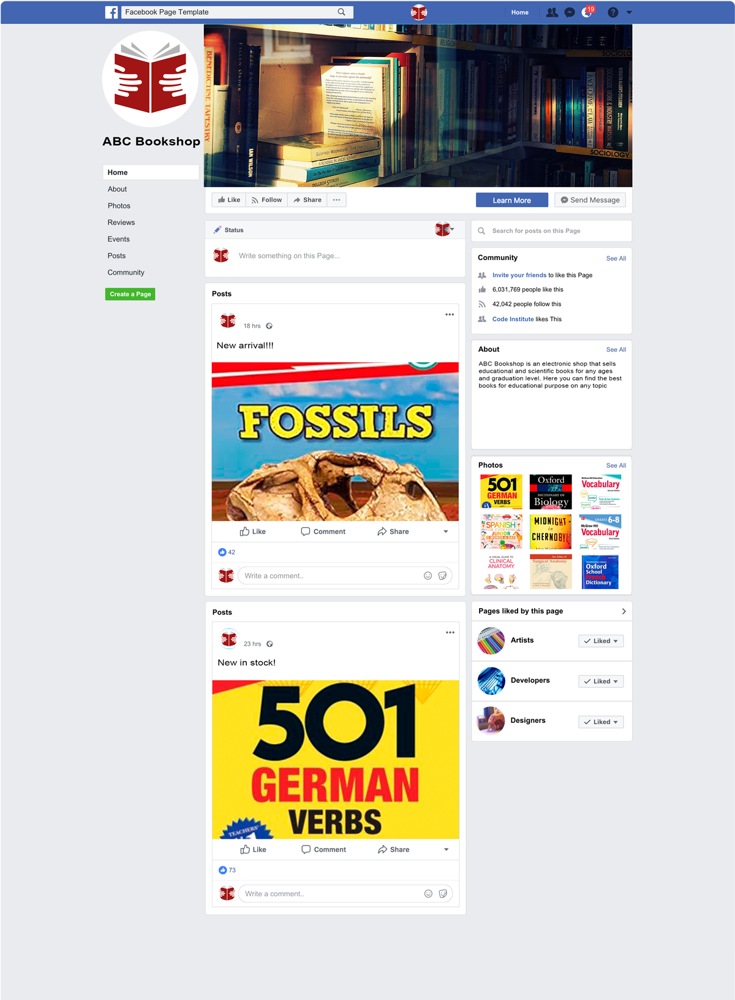

# *ABC Bookshop*

ABC Bookshop is a classic internet-shop which used as a platform for selling books especially for education purposes. It's made as a start-up and has a few book subjects but site owner can easiely add different book subjects by request and sells any.

One of ABC Bookshop feature is not only sell books by different subject/category but to provide age group appropriate division for all kinds of readers.

Our shop is located in Ireland and has orientation based on the Old World readers but also readers from different countries that available in list that you may see at checkout page can also buy them because we have international delivery.

You can access the ABC Bookshop here:
[ABC Bookshop](https://abcbookshop-78b85b076be8.herokuapp.com/)

If you wish to make a test purchase, you can use the following [Stripe Dummy Card](https://stripe.com/docs/testing) details:

- Test Card Number: 4242424242424242
- Exp Date: Any date in the future using the format MM/YY
- CVC: any 3 digit number
- Postcode: any 5 digits

Any payments made using a valid debit/credit card will not be processed and the card will not be charged.

For full Admin access to the Django Admin panel with relevant sign-in credentials: [ABC Bookshop Admin](https://abcbookshop-78b85b076be8.herokuapp.com/admin/)

For access to Admin Dashboard frontend view with relevant sign-in credentials: [ABC Bookshop Admin Dashboard](https://abcbookshop-78b85b076be8.herokuapp.com/bookstoremanagement/bookstoremanagement)

# Project

## Cutomer Goals

The main goal of the customer is to find interesting books to buy. What can be better than hold the real paper book in the hands? The customers are provided with a search field to quickly find books they are looking for. The customers can join the community on Facebook or sign up for a newsletter to be informed about the news within the shop. The customers can leave book review to express their opinion.

## Business Goal

ABC Bookshop provides a range of educational books for all ages. ABC Bookshop strives to create a community of education lovers to increase business possibilities. ABC Bookshop provides a very user friendly interface for bookshop admin where they can add/edit/delete books from the store, manage  enquiries. The admin can access all order details in the django admin panel and also can approve customer reviews.

## Business Model
ABC Bookshop was designed as a B2C - Business to Customer model - where the customer buys directly from the business. There are no intermediaries. This model enables direct communication with the customer and provides space for flexibility and quick reactions and adaptability to the customer's needs.

## Marketing Techniques
It is absolutely necessary to have online presence and recognition to be able to attract new customers and build a strong customer base. One of the ways to achieve this is through social platforms, e.g. the Facebook or Instagram platform, etc. Social media can be a great tool for attracting new customers and communicating with the current ones. I chose Facebook as a main communication mechanism.

* Facebook Page

   Due to Facebook doesn't allow me to create a test page for this project I created a mock up as it's real Facebook page for marketing purposes. The goal for a Facebook page is to create a community around around our ABC Bookshop and to increase commercial possibilities. I hope that through regular engagement with potential customers through posts, and other activities, we will be able to attract new customers. Facebook page will help us keep in touch with the current customers and provide a way for communication with new ones. We will be announcing new arrivals or special sales on this platform.

   <details><summary><b>Facebook Page</b></summary>

   

</details><br>

* Content marketing

   There are book review possibilities to attract potential customers read them and be involved into reading and measurement.

* E-mail Marketing

   Another form of online marketing is via mailing lists. ABC Bookshop users can opt to subscribe to the company's newsletter. New arrivals, sales or other activities will be announced through this platform. [Mailchimp](https://mailchimp.com/) was used to set up the newsletter subscription functionality.

* Search Engine Optimization (SEO)

   ABC Bookshop's goal is to include itself to the top of serch results and be at least on the first page of serch results content. Descriptive Meta Tags were implemented on the site to do it. I used [Wordtracker](https://www.wordtracker.com/) to find out content specific keywords. I tried to use not only short, but also long-tail words.

   The site also includes a sitemap.xml and robots.txt to make sure that the search engines can find and crawl the pages on the site. The sitemap.xml was generated using [XML Sitemap Generator](https://www.xml-sitemaps.com/) and placed in the root folder of the project and robots.txt as well. In real life to generate dynamical sitemap.xml file and have it visible for Google Search we need to create a special functionality with .py file in root project folder that will generate content for it and have right url record in urls.py to be found.

## Project Management

I used [GitHub's Projects](https://github.com/users/dimmando/projects/3) for organizing my project and tracking user stories. It is a very helpful tool to have Kanban board and it's quite alternative to [Trello](https://trello.com/) product for the same purposes.

First of all I spent some time on project planning, on thinking about it. I created wireframes and having them and the ERD model I found it very helpful and felt myself more confident.

When I am finished with the project, I planned to go back and analyze how many userstory points I was able to achieve compared with planned for my future project planning.

I tried to make mock up of my readme and testing files at the same as I finished each user stories.

I tried to fix bugs, small or big at once not to be accumulated too much left at the end.

Primarily, I focused on completing majority of the must-haves, and in later stages of the product development I would consider should and could-haves. At the same time, I was identifying user stories which would have to change into won't haves and be left for future development. Each of the user stories got labels such as: Must have, Should have, Could have, Won't have.

The Project tool has been very benefitial for my development process, especially because I could rely on having all the relevant information in one place.

### MoSCoW Prioritization

I tried to apply MoSCoW principles in my development but more on a project basis than on a sprint basis. First of all I focused on meeting must-have dev tasks and user stories. Then I started incorporating should-haves and then could-haves. As I went along, I also indentified won't-haves which left for future development.

- Must Have: must be delivered (around 60%)
- Should Have: add significant value, but not crucial (around 20%)
- Could Have: small impact if not implemented (around 20%)
- Won't Have: not crucial for this project

### Milestones

I didn't split my project development into milestones because not so many features/tasks are in place and not a lot of time was spent doing the project. It was shortened in time course with quick pace.

## Database Schema (ERD)

Here you can find [ERD Diagram](/documentation/erd.png)

I used [Lucid Charts](https://lucidchart.com/) to create my ERD schema.

This ERD schema was instrumental for creating all the necessary models for this project.

Models used in this project:
- Checkout (Order, OrderLineItem) - For creating/updating orders
- Enquiry - for adding/updating/removing FAQ and their answers
- Products (Category, Product) - for managing books, filtering, sorting and more
- UserProfile - used to collect and update contact/delivery information of the customers
- Reviews - for adding a review to book the customer have bought and not reviewed before
- Wishlist - for adding/removing items from the user's wishlist
- Allauth - used for signing in/out/up functionality

# User Experience (UX/UI)

**Primary Goal**

The primary goal of this project is to enable a purchase educational books. The shopping experience needs to be seemless and smooth.

**First Time Visitor**

  - A user sees the main features of the app on the welcome page: find a book by different search criteria or contact us.
  - A user can register, log in and logout.
  - An anonymous user can:
    -  browse the page
    -  search for books in the search window
    -  sort books by category, rating and price (sales price is taken into account)
    -  filter the books by skill level or/and age
    -  identify products in specials
    -  read book reviews if present
    -  contact the store by filling in a form
    -  read FAQs
    -  subscribe for a newsletter
    -  can see the contact information including the address, phone number and email
    -  can visit the store's Facebook page
    -  can follow the store through Twitter, Pinterest and Instagram (no real account)
    -  can read Terms and Conditions
    -  can read the store's Privacy Policy
    -  see information about their user actions
    -  see an updated shopping cart
    -  can confirm deletion
    -  can add/view/delete/update number of books in their shopping cart
    -  can add a book to their shopping bag directly form the all products view
    -  make a purchase
    -  receive an email with order confirmation
  - On top of that, a logged in user can:
    -  leave a review for books they had previously bought
    -  a user can review a book only once
    -  create a wishlist
    -  save their information in the Profile section under the profile icon and update it
    -  view their past orders
    -  save their contact details for the future
  - An admin user can:
    - manage books, enquiries in the bookshop management section (full CRUD functionality)
    - confirm deletion of products or enquiries
    - can approve a review

**Returning Visitor**

  - A user can easily sign in and access majority of the features of the website (leave a review, create a wishlist)
  - A user with filled in profile details can make a fast purchase.
  - A user can easily find books on sale/new arrivals

**Frequent Visitor**

  - A user can easily find a suitable book and make a quick purchase thanks to the saved personal and billing information and make use of any user features.


## Design Choices

Usually we start any internet business we try to create an attractive web-site where the user can easily find something they like. Firstly, I designed wireframes, then I was thinking which color scheme is best.

## Design Prototype (Wireframes)

I started by creating wireframes which is always a great process because it helps me think in much more detail about what I want to accomplish. As you will see from my wireframes I tried to work on my design including the hero picture and color scheme from the very beginning. I came across the wonderful picture of the girl happily reading a book when travelling in France and later I was able to find it on the internet. The author of this amazing mural is Jef Aerosol.

The wireframes include a view for desktop, tablet and mobile to take responsives into accout. Many of the simple pages look the same on all devices (sign in, sign up, logout, forms,...). For those whose layout is different on smaller devices, I created a sample wireframe. The main difference in smaller screen is a collapsed NavBar accessible at the hamburger icon and the footer where the items stack up. The number of displayed books and other relevant features also responds to the size of the screen.


I used [Figma](https://www.figma.com) which is an excellent tool for making wireframes.


**Desktop Wireframes**

<details><summary><b>Home Page</b></summary>


</details><br>

<details><summary><b>All Products Page</b></summary>


</details><br>

<details><summary><b>Product Detail Page</b></summary>


</details><br>

<details><summary><b>Products by Skill Level</b></summary>


</details><br>

<details><summary><b>Shopping Bag</b></summary>


</details><br>

<details><summary><b>Checkout</b></summary>


</details><br>

<details><summary><b>Admin Dasboard</b></summary>


</details><br>

<details><summary><b>My Profile</b></summary>


</details><br>

<details><summary><b>Blog</b></summary>


</details><br>

<details><summary><b>Blog Detail</b></summary>


</details><br>

**Tablet Wireframes**

<details><summary><b>Home Page</b></summary>


</details><br>

<details><summary><b>All Products Page</b></summary>


</details><br>

<details><summary><b>Product Detail Page</b></summary>


</details><br>

<details><summary><b>Products by Age/Skill Level</b></summary>


</details><br>

<details><summary><b>Shopping Bag</b></summary>


</details><br>

<details><summary><b>Checkout</b></summary>


</details><br>

<details><summary><b>Admin Dasboard</b></summary>


</details><br>

<details><summary><b>My Profile</b></summary>


</details><br>

<details><summary><b>Blog</b></summary>


</details><br>

<details><summary><b>Blog Detail</b></summary>


</details><br>

<details><summary><b>Login</b></summary>


</details><br>

**Mobile Wireframes**

<details><summary><b>Mobile Wireframes</b></summary>


</details><br>


**Color Scheme**

I got the idea for the main hero image and color theme when travelling in France in the summer and having come across the happy child reading a book mural by Jef Aerosol. It took me a while to find the image online and refine it using the [AI Image Sharpener](https://vanceai.com/sharpen-ai/) to make it a bit more sharp. The image I found had orange background, so I used it as one of main background colors and found the complementary colors by using [Coloors](https://coolors.co/).

<details><summary><b>Color Scheme</b></summary>


</details><br>

**Typography and Icons**

As regards the icons, I mainly used fontawesome icons, as they are easy to use and are consistent in style. I used 'Raleway' font from Google fonts and it seemed to work well with the bookshop theme. The font is also easily legible which is a very important requirement.


# Features

## User View - Guests/Account Holders

| Feature   | Guest | Registered, Account Holder |
|-----------|-------------------|-----------------|
| Home Page | Visible           | Visible         |
| Account  | n/a | 'My Profile' option including order history and delivery information |
| All Products  | Items can be viewed and added to Bag, Wishlist not available, Reviews visible | Wishlist available, possible to review products |
| Categories/Filtering/Sorting   | Visible | Visible|
| Search  | Visible | Visible |
| Contact Us/Newsletter | Visible | Visible |
| Enquiries | Visible | Visible |
| Admin Dashboard | Not Visible | Only available to Admin |

## CRUD Functionality

Customers have full CRUD functionality for the shopping bag (viewing/adding/updating the amount/removing products from bag). They may also edit their delivery details if they are registered, logged-in users. Logged in customers may also view/add and remove products from their Wishlist and add reviews to books they had previously bought. ABC Bookshop Admin has access to the Admin Dashboard which allows them full CRUD for Books/Enquiries Management.

## Features Details

**Navbar**

At the top of the page there is a navbar. At the top there is a **delivery banner** with information about the threshhold price which qualifies the customers for free delivery. Currently the threshhold price is set to €30.

Second row contains the company's Logo, which is clickable and takes the user to the Home page.

In the middle of the second row, there is a search bar which allows for searching books. This is not available for enquiries (future feature).

When the user is not signed in, only Profile (Register/Login options only) and Shopping bag icons are available.

**Guest User**

<details><summary><b>Top Navbar Guest</b></summary>


</details><br>

**Logged in User**

A wishlist icon becomes available for the signed in user.

<details><summary><b>Wishlist Icon</b></summary>


</details><br>

If the user signs in, they can access My Profile, where default information is saved and they can access their past orders.

<details><summary><b>My Profile</b></summary>


</details><br>

Wishlist and Shopping bag icons change color if there is at least one product present.

<details><summary><b>Wishlist/Bag Icons orange</b></summary>


</details><br>

**Collapsible Navbar**

<details><summary><b>Collapsed Navbar</b></summary>


</details><br>

<details><summary><b>Hamburger Open</b></summary>


</details><br>

**Navbar Bottom Row**
In the last row of the navbar the user can click the following links:
- Home - takes the user to the home page
- Books - product sorting by price, category, name and rating is available.
- Skill level - category filtering available (reluctant, keen and avid reader)
- Special offers - new arrivals, on sale
- Contact us - takes the user to the contact form

<details><summary><b>Navbar Bottom Row</b></summary>


</details><br>

<details><summary><b>Navbar Sorting</b></summary>


</details><br>

<details><summary><b>Navbar Skill Level</b></summary>


</details><br>

<details><summary><b>Navbar Specials</b></summary>


</details><br>

**Account registration/login/logout**

All user functionalities are a result of using django-allauth. Using this package has enabled me to set this functionality up quickly and easily. The user is informed if their password is too common or if it is too similar to their user name or email address.

**Sign Up Page**

Sign up Page has a simple design. The user has to enter their email address and password twice. This is due to defensive programming principle where we try to avoid unnecessary errors caused by small typos.

The user has to confirm their email address to finish up the registration process.

[Sign Up Page](./readme-images/signup_page.png)

[Verification Email received](./readme-images/confirm_email_address.png)

[Confirm Email page](./readme-images/confirm_email_address_page.png)

[Email confirmed](./readme-images/email_address_confirmed.png)

[Sign Up Success](./readme-images/successful_login.png)


**Sign In Page**

[Sign In Page](./readme-images/signin_page.png)

[Sign In Success](./readme-images/successful_login.png)


**Logout Page**

[Sign Out Page](./readme-images/signout_page.png)

[Sign Out Success](./readme-images/signout_success.png)


The user can choose to remember their profile and they can avail of the inbuilt forgot password functionality as well.

**Home Page**

The design of the home page is very simple. A hero image of a girl happily reading a book is visible (the story of this image can be found earlier in the document) and there is a call to Action present. The Shop Now button takes the users to the all books page.

<details><summary><b>Home Page</b></summary>


</details><br>


**Books**

<details><summary><b>All Books</b></summary>


</details><br>

The user can get to all books page by different routes, e.g. by clicking Shop Now button on the main page. On this page all books are displayed on product cards which contain the book's image, title, price, category, age range, rating, Add to Bag and Add to Wishlist/Remove from Wishlist buttons. The latter is available only for a signed in user if the item is already in the wishlist.

The books are displayed in rows of 4, 3, 2 or one depending on the screen size. As there are only 24 books in the store's offer at the moment, I did not include pagination functionality also because I assume the user will be filtering the store's offer by different criteria and thus the list of displayed products will be significantly shorter. Paganation will be included as soon as the number of products is above 40 to prevent the user from having to scroll for too long.

The user can directly add one piece of the chosen product to the shopping bag.

The user can add a product to the wishlist if they are signed in.

The heading always reflects what segment of books is being displayed (e.g. All Books, Reluctant Reader, New Arrivals,...).

Sorting products by price, rating, name and category is available from the navbar. The books can be ordered in descending or ascedning order. The sorting choice is reflected in the sorting window, which is available in the right top corner.

Sorting by sales price works correctly (sales price is taken into account if a product is on sale).

If a product is in one or more of the specials categories, the correct icons are displayed in the top right corner of the product card. If a product is on sale, the sale price is on the right in red and the original price is crossed out.

Age filtering is available under the main heading on all products page. The age filtering takes into account a previous segment selection. E.g. if reluctant reader category is displayed and the user chooses 6-8 age group, only books for this age category from among reluctant readers are shown.

All of the above mentioned features are recorded on this video:

https://github.com/lucia2007/ABC Bookshop/assets/51453242/b929d1b6-1c48-4501-9d87-49d8269242e9

If an admin is signed in, the edit/delete buttons are visible on the individual product cards as well. For details see the admin section.

Back to top button is present in the right bottom corner of the page.

**Book Detail View**

Each book detail page contains an image of the book, the title, the author, category, age range, price, rating and book description. The description is collapsed and can be unpacked by clicking read more button or collapsed by clicking read less button.

The quantity of the product can be adjusted before add the product to the shopping bag. Only whole numbers can be accepted and the user is informed if they try to add a floating number.

Keep shopping button takes the user back to all books view. A correct specials icon is included under the book picture. Also a Add to wishlist button is present and it changes to Remove from wishlist button if the user had previously added this product to their wishlist.

<details><summary><b>Book Detail</b></summary>


</details><br>

<details><summary><b>Book Detail Read less/Remove from Wishlist</b></summary>


</details><br>

If an admin is signed in, the edit/delete buttons are visible as well. For details see the admin section.

If a book has been reviewed before, there is also an expandable button with a review icon and number of reviews present. For more details please see the Reviews section.

If a book image is clicked, the image opens in a new tab for a more detailed view.

**Contact Form**

A user can send an enquiry to the store admin.

<details><summary><b>Contact Us</b></summary>


</details><br>

They see a thank you page when the enquiry is submitted and also a success toast.

<details><summary><b>Thank you/Success Toast</b></summary>


</details><br>

An email is received by admin which they can reply to.

<details><summary><b>Enquiry Email Received</b></summary>


</details><br>

**My Profile**

If a user has created an account with ABC Bookshop, they can save and update their default delivery information under their "My Profile" link under the Profile icon. Also the order history is accessible there and the orders are ordered from the newest to the oldest.

<details><summary><b>My Profile</b></summary>


</details><br>

The order history number is clickable and opens up a past order confirmation (the user is informed about this being a past confirnation).

<details><summary><b>Order Past Confirmation</b></summary>


</details><br>

Back to Profile button takes the user back to their My Profile page.

**Shopping Bag**

As this is an ecommerce project, one of the crucial features is the possibility to add products to the shopping bag and subsequently make a purchase.

Both a guest and a registered user can make a purchase. If the user has an account, they can access their order history under My Profile. Both guest and registered users will receive an email upon purchase.

A user can add one book directly from the all books view by clicking on Add to Bag button, or they can adjust the quantity in the book detail view and add a product from there. The entered quantity must be a whole number and must not exceed 10 pieces due to the restricted capacity of the book store.

When a user adds a product to their bag, they see a success toast with the bag information and are informed about the delivery cost if the total amount is below €30. They can choose to click on Go to Your Bag and go to the shopping bag page where they can adjust the amount/remove the book entirely or click Keep Shopping button to continue shopping. User is informed about all of their actions and the updated quantities are reflected in the success toast.

As soon as there is at least one item in shopping bag, the icon changes color to orange.

<details><summary><b>Add to Bag Success Toast</b></summary>


</details><br>

<details><summary><b>Add to Bag Success No Delivery Cost</b></summary>


</details><br>

<details><summary><b>Shopping Bag</b></summary>


</details><br>

<details><summary><b>Remove from Shopping Bag</b></summary>


</details><br>

<details><summary><b>Shopping Bag Quantity Update Mobile</b></summary>


</details><br>

**Secure Checkout**

The checkout process for ABC Bookshop is done through the [Stripe](https://stripe.com/docs) API.

Both a guest and signed in user can go to checkout by clicking Go to Checkout button. If the user has an account and are signed in, their information is prefilled, if previously saved. They have to enter their Full Name and add credit card details. For testing purchases this card number was used: 4242 4242 4242 4242. The user must enter a future expiry date, the secure number and a 5 digit postcode.

The user can choose to adjust bag their bag which takes them back to their shopping bag, or to click Complete Order button.

The Stripe Payment form accepts the user's information and informs them if they try to use an invalid card number. Form validation is also present and the user is informed if they have not entered all of the details.

<details><summary><b>Checkout</b></summary>


</details><br>

A loading spinner is visible until the order has been processed.

<details><summary><b>Order Processing</b></summary>


</details><br>

As soon as the order is processed, the customer gets an email confirmation and is shown the order success message with order details.

<details><summary><b>Order Success</b></summary>


</details><br>

<details><summary><b>Order Email Confirmation</b></summary>


</details><br>

As a developer I can confirm in Stripe webhooks that the orders has been successfully processed.

<details><summary><b>Webhook Success</b></summary>


</details><br>

**Review Books**

When a user receives their order confirmation, there is a list of products with details present. The individual books can be clicked on and the user is taken to the detail page of the particular book. If the user is signed in and they had not reviewed this particular book previously, there is a review form present where the user can express their opinion. These review links are available in the order history under My Profile as well.

<details><summary><b>Book Review Form</b></summary>


</details><br>

Upon submission, the user is informed that the admin has to approve the review first.

<details><summary><b>Book Review Waiting for Approval</b></summary>


</details><br>

As soon as the review is approved, the number of reviews on the detail page of the chosen book is automatically updated and the user can click on the reviews button and the review is visible.

<details><summary><b>Book Review Added</b></summary>


</details><br>

Each user can review a particular book only once. So in case the customer had bought the same book before and had already reviewed it, the review form will not be visible.

**Wishlist**

As mentioned before, a wishlist functionality is available for registered users only.

If a guest user attempts to add an item to their wishlist, they are asked to login (register) and then they can avail of this functionality.

If a user attempts to add a book which is already in their wishlist, they are see a warning message.

<details><summary><b>Already In Wishlist</b></summary>


</details><br>

If a particular book was added to the wishlist and the user is signed in, the Add to Wishlist button changes to Remove from Wishlist button.

<details><summary><b>Remove From Wishlist Button</b></summary>


</details><br>

On the Wishlist page the user can choose to add the book to their shopping bag.

<details><summary><b>Wishlist Page</b></summary>


</details><br>

**bookshop management/Admin (CRUD functionality)**

When an admin user is logged in, the bookshop Management link is available under their Profile. This feature was added so that the store admin user can perform all necessary tasks around store management without having to access the Django admin panel. Only a signed in admin user can access the bookshop management link.

<details><summary><b>bookshop Management Link</b></summary>


</details><br>

<details><summary><b>bookshop Management Page</b></summary>


</details><br>

An admin can add/edit/remove books from the store, add/edit/remove enquiries.

When an admin user is signed in, edit/delete buttons are present on the book and enquiry cards.

<details><summary><b>Edit/Remove Buttons Books</b></summary>


</details><br>

<details><summary><b>Edit/Remove Buttons FAQs</b></summary>


</details><br>

**Book Management**

**Add Book**

When the admin clicks an Add Book button, they are taken to an add a book form. Input is validated (e.g. all numbers must be positive integers, more details in the testing file).

<details><summary><b>Add Book Form</b></summary>


</details><br>

If a book without an image is added, a placeholder image is used in its place.

<details><summary><b>Placeholder Book Image</b></summary>


</details><br>

When the user clicks on the edit button, they are taken to all books view, where the edit buttons are visible and clickable.

On the edit book form, the book details are already prefilled and can be amended.

<details><summary><b>Edit Book Form</b></summary>


</details><br>

When the admin wants to delete a book, they are shown a deletion modal to provide a chance to cancel the deletion. If they are sure and confirm deletion, the product is deleted.

<details><summary><b>Confirm Book Deletion</b></summary>


</details><br>

<details><summary><b>Book Deleted</b></summary>


</details><br>

**Enquiries/Enquiries Management**

There is a link to enquiries/FAQs in the footer to provide quick answers to common questions of the store's customers. The questions are clickable and answers are displayed.

<details><summary><b>All Enquiries Collapsed</b></summary>


</details><br>

<details><summary><b>All Enquiries Unpacked</b></summary>


</details><br>

**Add Enquiry**

When the admin clicks an Add Enquiry button, they are taken to an add an enquiry form. Input is validated (more details in the testing file).

<details><summary><b>Add Enquiry Form</b></summary>


</details><br>

The admin can choose to save the enquiry as a draft in which case only admin can see it in the all enquiries view.

<details><summary><b>Draft Enquiry</b></summary>


</details><br>

When the user clicks on the edit button, they are taken to all enquiries view, where the edit buttons are visible and clickable.

On the edit enquiry form, the enquiry details are already prefilled and can be amended.

<details><summary><b>Edit Enquiry Form</b></summary>


</details><br>

When the admin wants to delete an enquiry, they are shown a deletion modal to provide a chance to cancel the deletion. If they are sure and confirm deletion, the enquiry is deleted.

<details><summary><b>Confirm Enquiry Deletion</b></summary>


</details><br>

<details><summary><b>Enquiry Deleted</b></summary>


</details><br>

**Footer**

At the bottom of the page there is a footer. For easy of use, all main navigation links are present.

<details><summary><b>Footer</b></summary>


</details><br>

- Links to social media including the store's Facebook page

<details><summary><b>Social Media Links</b></summary>


</details><br>

- Frequently Asked Questions (more details above)

- Privacy Policy

<details><summary><b>Privacy Policy</b></summary>


</details><br>

- Terms of Use

<details><summary><b>Terms of Use</b></summary>


</details><br>

Both Privacy Policy and Terms of Use were generated by using termly.io.

- Shipping Info (can be found in FAQs)

A customer can subscribe to a **Newsletter** by clicking the Subscribe Now! button, also present in the footer. 

Last but not least, the user can see the contact information, including the address, email and a mobile number.

The footer is responsive and was optimized for small devices by collapsing some of the information under the HELP link. This is to reflect on the feedback for my last project where the footer was too long for small devices and was taking up too much space.

<details><summary><b>Footer Small Devices</b></summary>


</details><br>

<details><summary><b>HELP Open</b></summary>


</details><br>

**Newsletter**

In order for customers to stay informed about the goings in our bookshop we provide a newsletter functionality. This feature was developed through [Mail Chimp](https://mailchimp.com/) which is a very friendly and easy to use service. We plan to send out emails once a month, announcing sales, new arrivals. In the future we plan to add an occasional discount code and inform our customers about live book readings for the kids.

When the user clicks on Subscribe Now! button, they are taken to a separate page, where they can easily fill in their email and subscribe.

<details><summary><b>Newsletter</b></summary>


</details><br>

The user is informed if they had signed up previously or if they enter an invalid email. 

<details><summary><b>Already Subscribed</b></summary>


</details><br>

<details><summary><b>Invalid Email</b></summary>


</details><br>

The unsubscribe functionality is not currently available, but it is on the list of future features.

**Deletion Modals**

For deleting products and enquiries, the user is always asked to confirm their choice to delete the chosen item to avoid accidental deletion. This is an example of the application of defensive programming. Images of deletion modals are included under bookshop Management section. This functionality was not added to wishlist remove buttons, as the product is not deleted from the database and can easily be added back to the wishlist.

**403, 404 and 500 Error Pages**

If a user navigates to a page that does not exist, a customized 404 error page will appear.

[404 Error Page Image](readme-images/404_error_page.png)

If a user attempts to do something they are not authorized to do, they will get a 403 Error page.

[403 Error Page Image](readme-images/403_error_page.png)

If a user navigates to a page and there is a server related issue/error, they will be shown a customized 500 error page.

[500 Error Page Image](readme-images/500_error_page.png)

## Future Features

I did not manage to develop all of the features which I wished to use in this project, but in case of some of them, I knew from the beginning they would have to be left for future development.

Here are some of the features I wish to implement in the future:
- Social Account Sign up
- Exchange an old book for store credit - this would be a very cool feature to implement, to help with sustainability and to protect the environment, aleternatively send a discout code for returned used books
- This store could offer stationary and related back-to-school products
- Montesorri toys and materials to help children improve their reading skills through play could complement the offer
- Books should have more attributes - hardcover/paperback, publisher, genre
- Customer rating - in the future I hope to include an interactive customer rating system. At the moment the rating value was taken from Amazon.
- Blog functionality including commenting
- Unsubscribe from newsletter
- One more thing that needs to be done is allowing the admin to approve reviews from the admin panel, as at the moment they can do it only throught the django admin panel

# Technologies Used
## Languages

- [Python](https://www.python.org/) - Used for adding functionality to the application.
- [HTML5](https://en.wikipedia.org/wiki/HTML) - Provides the content and structure for the website.
- [CSS3](https://en.wikipedia.org/wiki/CSS) - Provides the styling for the website.
- [JavaScript](https://en.wikipedia.org/wiki/JavaScript) - Provides interactive elements of the website

## Frameworks and Software

- [Bootstrap](https://getbootstrap.com/) - A CSS framework that helps building solid, responsive, mobile-first sites.
- [Django](https://www.djangoproject.com/) - An MVT framework used to create the Tennis Buddies site.
- [Figma](https://figma.com) - Used to create wireframes.
- [Github](https://github.com/) - Used for hosting the repository.
- [Projects in GitHub](https://github.com/lucia2007?tab=projects) - Used for project managament.
- [Heroku](https://heroku.com/) - Used for deploying the application.
- [Gitpod](https://www.gitpod.io/#get-started) - Used for developing the application.
- [Markdown Table Generator](https://www.tablesgenerator.com/markdown_tables) - Used to generate tables in Markdown.
- [Favicon Converter](https://favicon.io/favicon-converter/) - used to create a favicon in correct format.
- [Lighthouse](https://developer.chrome.com/docs/lighthouse/overview/) - Used to test performance of site.
- [Responsive Design Checker](https://www.responsivedesignchecker.com/) - Used for responsiveness check.
- [Google Chrome DevTools](https://developer.chrome.com/docs/devtools/) - Used for debugginf and responsiveness testing.
- [HTML Validation](https://validator.w3.org/) - Used to validate HTML code
- [CSS Validation](https://jigsaw.w3.org/css-validator/) - Used to validate CSS code
- [CI Python Linter](https://pep8ci.herokuapp.com/#) - Used for validation python code.
- [Lucid Charts](https://lucidchart.com/) - for creating my ERD Diagram
- [AWS](https://aws.amazon.com/) - used for holding images and email sending sfunctionality
- [Stripe](https://stripe.com/en-cz) - used for providing a payment method to the store


# Python Packages

Following packages and libraries were installed and are located in requirements.txt.
- asgiref==3.7.2
- boto3==1.28.54
- botocore==1.31.54
- dj-database-url==0.5.0
- Django==3.2.21
- django-allauth==0.41.0
- django-countries==7.2.1
- django-crispy-forms==1.14.0
- django-richtextfield==1.6.1
- django-storages==1.14
- django-stubs==4.2.4
- django-stubs-ext==4.2.2
- django-summernote==0.8.20.0
- gunicorn==21.2.0
- jmespath==1.0.1
- oauthlib==3.2.2
- Pillow==10.0.0
- psycopg2==2.9.7
- python-dateutil==2.8.2
- python-slugify==8.0.1
- python3-openid==3.2.0
- requests-oauthlib==1.3.1
- s3transfer==0.6.2
- sqlparse==0.4.4
- stripe==6.5.0
- text-unidecode==1.3
- types-dj-database-url==1.3.0.4
- types-pytz==2023.3.0.1
- types-PyYAML==6.0.12.11
- types-stripe==3.5.2.14
- urllib3==1.26.16


# Testing

To test the aspects of the application, I used manual testing and external validators. Both manual and external testing are a part of a separate [testing file](/TESTING.md).


# Project Deployment

It is advisable to do an early deployment of the application to be able to regularly check both the local and the deployed versions of the project. Testing of responsivness on different devices is easy with the deployed version. (I could share the link for the deployed app with my friends and receive early feedback.) I found that sometimes it took up to several hours for changes to show in the deployed version, so an early deployment is definitely advantageous to avoid last minute scares.

Follow the steps below to deploy your project:
## Create a new GitHub Repository from CI template

- Navigate to [GitHub](https://github.com) and create a GitHub repository from the [Code Institute template](https://github.com/Code-Institute-Org/gitpod-full-template) by following the link and then click 'Use this template'.

<details><summary><b>Create GitHub Repository</b></summary>


</details><br>

- Fill in the needed details as stated in the screenshot below and then click 'Create Repository From Template'. The name you choose must be unique.

<details><summary><b>Choose Repository Name</b></summary>


</details><br>

- When the repository is created, click the green 'Gitpod' button as stated in the screenshot below.

<details><summary><b>Click Green GitPod Button</b></summary>


</details><br>


## Install Django and the supporting libraries

- To install Django and the supporting libraries, type the commands below.

* ```pip3 install 'django<4' gunicorn```
* ```pip3 install dj_database_url psycopg2```

<details><summary><b>Install Supporting Libraries</b></summary>


</details><br>

- When Django and the libraries are installed we need to create a requirements file.

* ```pip3 freeze --local > requirements.txt``` - This will create and add required libraries to requirements.txt

<details><summary><b>Create Requirements File</b></summary>


</details><br>

- Create the project.

* ```django-admin startproject YOUR_PROJECT_NAME .``` - This will create your project

<details><summary><b>Create Project</b></summary>


</details><br>

- When the project is created, we can now create the application.

* ```django-admin startapp APP_NAME``` - This will create your application

<details><summary><b>Create Application</b></summary>


</details><br>

- To create a superuser type in the following code:
`python3 manage.py createsuperuser`

You will be asked to enter credentials after which the superuser is created.  

- We now need to add the application to settings.py

<details><summary><b>Add Application to settings.py</b></summary>


</details><br>

- Now do your first migration and run the server to test that everything works as expected. This is done by writing the commands below.

* ```python3 manage.py migrate``` - This will migrate the changes.
* ```python3 manage.py runserver``` - This runs the server. To test it, click the 'open browser' button that will be visible after the command is run.

- Create `env.py` file at the root level and include the following environment variables. Don't forget to add the `env.py` file in the `.gitignore` in order to keep your secret information from becoming unsafe:

`import os`

`os.environ["DATABASE_URL"] = "insert your own ElephantSQL database URL here"`

`os.environ["SECRET_KEY"] = "this can be any random secret key"`


- In the `settings.py` add the following code under `from pathlib import Path`:

`import os`

`import dj_database_url`

`if os.path.isfile("env.py"):`

`import env`

* Replace the original unsafe SECRET_KEY with the following code:

`SECRET_KEY = os.environ.get('SECRET_KEY')`

* Set `DEBUG = "DEVELOPMENT" in os.environ`. This allows us to have DEBUG set to True when developing locally, but set to False when deployed to Heroku.

* Replace the original `DATABASES` code with the following lines (this allows us to use the postgress database instead of the sqlite3 databases):

`
DATABASES = {
    'default': dj_database_url.parse(os.environ.get("DATABASE_URL"))
  }
`

* Link the file to the Heroku templates directory:
- Under ``BASE_DIR`` enter ``TEMPLATES_DIR = os.path.join(BASE_DIR, ‘templates’)``
- Update ``TEMPLATES = 'DIRS': [TEMPLATES_DIR]`` with:

```
os.path.join(BASE_DIR, 'templates'),
os.path.join(BASE_DIR, 'templates', 'allauth')
```

* Create the following folders at the top level directory:
  * media
  * static
  * templates
  
* Create a file called **Procfile** and add the following line in it:
`web: gunicorn PROJ_NAME.wsgi`

* Make necessary migrations.

* Save all the files and do the first commit and push to GitHub:
  * `git add .`
  * `git commit -m "Deployment Commit"`
  * `git push`


## ElephantSQL Database

[ElephantSQL](https://www.elephantsql.com/) is used for the PostgreSQL database in this project.

To create your own PostgreSQL database, sign-up with your GitHub account and follow these steps:
- Click **Create New Instance** to initiate a new database.
- Choose a name, usually the name of the project.
- Select **Tiny Turtle(Free)** plan.
- Leave the **Tags** blank.
- Select **Region** and **Data Center** closest to you.
- Afterwards, click on the new database name, where you can view the db URL and Password. Copy the URL and enter the address into your **config vars in Heroku** and into your `env.py` file.


## Heroku Deployment

The project was deployed to [Heroku](https://www.heroku.com). To deploy, please follow the process below:

Create the application on Heroku, attach a database, prepare the `env.py` and `settings.py` file and setup the **AWS storage** for static and media files. 

* Go to [Heroku](https://www.heroku.com/) and sign in (or create an account if needed).

* Once signed in, click the button "New" in the top right corner, below the header and choose "Create new app". The name you choose must be unique. Choose a region which is closest to you.

<details><summary><b>Create New App</b></summary>


</details><br>

<details><summary><b>Choose Name and Region</b></summary>


</details><br>

- This brings you to the "Deploy" tab. From here, click the "Settings" tab and scroll down to the "Config Vars" section and click on "Reveal Config Vars". Click the "Add" button on the right and add the following key/value pairs:

   - **DATABASE_URL**:**postgres://...**
   - **DISABLE_COLLECTSTATIC** of value '1'
   - **SECRET_KEY** and value  
   - **AWS_ACCESS_KEY** and value
   - **AWS_SECRET_ACCESS_KEY** and value
   - **EMAIL_HOST_PASS** and value
   - **EMAIL_HOST_USER** and value
   - **STRIPE_PUBLIC_KEY** and value
   - **STRIPE_SECRET_KEY** and value
   - **STRIPE_WH_SECRET** and value
   - **USE_AWS** and value

- `DISABLE_COLLECTSTATIC` variable is needed only for the initial deployment, later this variable must be removed.

Heroku needs two additional files in order to deploy properly (see above):
- `requirements.txt`
- `Procfile` 

- Scroll back to the top of the page and choose the "Deploy" tab. Then choose "GitHub" as Deployment method.
   
<details><summary><b>Deployment method</b></summary>


</details><br>

Go to "Connect to GiHub" section, search for the repository name and then click "Connect".
   
<details><summary><b>Connect to GitHub</b></summary>


</details><br>

- In the "Automatic Deploys" section, choose your preferred method for deployment. At first, I used the manual deployment option, and later I changed it to automatic deploys. Afterwards, click "Deploy Branch".
   
<details><summary><b>Automatic Deploys</b></summary>


</details><br>

Alternatively, you can follow these steps:
- In the Terminal/CLI connect to Heroku by typing in: `heroku login -i`
- Set the remote for Heroku: `heroku git: remote -a app_name` (replace app_name with your app name)
- After doing Git `add`, `commit`, `push` to GitHub, you can type in: `git push heroku main`

The project should now be deployed to Heroku.

The link to the the live site can be found here - https://ABC Bookshop-c20568b2004e.herokuapp.com/.
The link to the GitHub repository can be found here - https://github.com/lucia2007/ABC Bookshop.

Add the Heroku host name into **ALLOWED_HOSTS** in your projects **settings.py file** -> ```['herokuappname', ‘localhost’, ‘8000 port url’].```

**DISABLE_COLLECTSTATIC**  may be removed from the Config Vars once you have saved and pushed an image within your project.

## Google Mail Setup

To be able to receive emails upon registration, checkout and from the contact form, you need to set up app password in your Gmail.

- Setup a Gmail account that will be used to hold and store the emails for your project.
- Log in, navigate to **Settings** -> **Other Google Account Settings** -> **Accounts** -> **Import** -> **Other Account Settings**
- Activate 2-Step Verification
- Once verified access **App Passwords** -> **Other** -> enter a name for the password, eg ABC Bookshop.
- Click **Create** -> copy the 16 digit password that is generated.
- In your `settings.py` add the following Email Settings:
   [Django email settings](./readme_images/../readme-images/email_settings.png)  
- Add EMAIL_HOST_PASS, EMAIL_HOST_USER variable, password and email address to your Heroku Config Vars

## AWS Config

[AWS](https://aws.amazon.com) is used to store the media and static files online for ABC Bookshop. To set it up for your project, please follow the steps below:

- Setup AWS Account and Login
- Create a new S3 Bucket -> name it to match your Heroku App name -> Choose the region closest to you.
- Allow **Click All Public Access**, tick 'Bucket will be public' in order for the bucket to connect to Heroku. 
- In **Object Ownership** -> **ACLS Enabled** -> **Bucket Owner Preferred**.
- **Properties** tab -> turn on static web hosting and add 'index.html' and 'error.html' into the correct fields -> click **Save**
- In the **Permissions** tab, paste in the following CORS config:

   ```
	[
		{
			"AllowedHeaders": [
				"Authorization"
			],
			"AllowedMethods": [
				"GET"
			],
			"AllowedOrigins": [
				"*"
			],
			"ExposeHeaders": []
		}
	]
	```
- Copy your **ARN** string.
- From the **Bucket Policy** tab, select the **Policy Generator** link, and use the following steps:
	- Policy Type: **S3 Bucket Policy**
	- Effect: **Allow**
	- Principal: `*`
	- Actions: **GetObject**
	- Amazon Resource Name (ARN): **paste-your-ARN-here**
	- Click **Add Statement**
	- Click **Generate Policy**
	- Copy the entire Policy, and paste it into the **Bucket Policy Editor**

		```shell
		{
			"Id": "Policy1234567890",
			"Version": "2012-10-17",
			"Statement": [
				{
					"Sid": "Stmt1234567890",
					"Action": [
						"s3:GetObject"
					],
					"Effect": "Allow",
					"Resource": "arn:aws:s3:::bucket-name/*"
					"Principal": "*",
				}
			]
		}
		```
    - Before you click "Save", add `/*` to the end of the Resource key in the Bucket Policy Editor (like above).
	- Click **Save**.
- In the **ACL - Access Control List** -> **Edit** -> enable **List** for **Everyone(Public Access)** -> Accept the warning.

### AWS - IAM setup

- In AWS Services Menu click **Create New Group**, add name eg. 'group-project-name'.
- Navigate to **Review Policy** page -> **User Groups** -> Select newly named group.
- Navigate to **Permissions** tab -> **Add Permissions** -> Click **Attach Policies**
- Select policy -> **Add Permissions** at the bottom, click when finished.
- From **JSON** tab -> select **Import Managed Policy** link -> search for **S3** -> select **Amazon3FullAccess** policy -> **Import**.
- Copy **ARN** from S3 Bucket again ->

   ```
		{
			"Version": "2012-10-17",
			"Statement": [
				{
					"Effect": "Allow",
					"Action": "s3:*",
					"Resource": [
						"arn:aws:s3:::bucket-name",
						"arn:aws:s3:::bucket-name/*"
					]
				}
			]
		}
	```
- Click **Review Policy** -> name eg. 'ABC Bookshop Policy' -> enter a description -> **Create Policy**
- Search for your new policy and click on it to **Attach Policy**
- **User Groups** -> **Add User** -> name eg. 'ABC Bookshop user'
- For **Select AWS Access Type** -> select **Programmatic Access** -> Add group to 'ABC Bookshop user' -> **Review User** -> **Create User**.
- Find **Download.csv** button to download crendetials and save a copy. The file can be downloaded only once, so make sure to save it securely.
  - This file contains the user's **Access key ID** and **Secret access key**.
	- `AWS_ACCESS_KEY_ID` = **Access key ID**
	- `AWS_SECRET_ACCESS_KEY` = **Secret access key** 
- Add these variables into your env.py and Heroku config vars.
### Media Folder Setup
1. In Heroku Config Vars, remove `DISABLE_COLLECTSTATIC` (after at least one image has been added).
2. In AWS S3 create a new folder -> **media** -> Add project images -> **Manage Public Permissions** -> **Grant public read access to the objects** -> **Upload**

### Django AWS Connect

- Install following packages to use AWS S3 Buckets in Django:
   - `pip3 install boto3`
   - `pip3 install django-storages`
- 
- Add the following code in settings.py:
   ```
   INSTALLED_APPS = [
       'storages',
   ]

- Check if AWS variables are present in env.py and if environment variable paths are set in settings.py:
   ```
   import os
   from pathlib import Path
   import dj_database_url

   if os.path.isfile('env.py'):
   import env
   ```

- Check if DATABASES are set up to connect with Heroku Postgres server in production vs SQLite3 when in local development.
   ```
   if "DATABASE_URL" in os.environ:
	DATABASES = {
		"default": dj_database_url.parse(os.environ.get("DATABASE_URL"))
	}
    else:
	DATABASES = {
		"default": {
			"ENGINE": "django.db.backends.sqlite3",
			"NAME": os.path.join(BASE_DIR, "db.sqlite3"),
		}
	}
    ```

- Set up media and static file storage in settings.py:
   ```
   STATIC_URL = "/static/"
   STATICFILES_DIRS = (os.path.join(BASE_DIR, "static"),)

   MEDIA_URL = "/media/"
   MEDIA_ROOT = os.path.join(BASE_DIR, "media")
   ```

- Set up S3 Bucket config in settings.py:
   ```
   if 'USE_AWS' in os.environ:
    # Cache control
    AWS_S3_OBJECT_PARAMETERS = {
        'Expires': 'Thu, 31 Dec 2099 20:00:00 GMT',
        'CacheControl': 'max-age=94608000',
    }

    # Bucket Config
    AWS_STORAGE_BUCKET_NAME = 'ABC Bookshop-096aafe5d13c'
    AWS_S3_REGION_NAME = 'eu-west-1'
    AWS_ACCESS_KEY_ID = os.environ.get('AWS_ACCESS_KEY_ID')
    AWS_SECRET_ACCESS_KEY = os.environ.get('AWS_SECRET_ACCESS_KEY')
    AWS_S3_CUSTOM_DOMAIN = f'{AWS_STORAGE_BUCKET_NAME}.s3.amazonaws.com'

    # Static and media files
    STATICFILES_STORAGE = 'custom_storages.StaticStorage'
    STATICFILES_LOCATION = 'static'
    DEFAULT_FILE_STORAGE = 'custom_storages.MediaStorage'
    MEDIAFILES_LOCATION = 'media'

    # Override static and media URLs in production
    STATIC_URL = f'https://{AWS_S3_CUSTOM_DOMAIN}/{STATICFILES_LOCATION}/'
    MEDIA_URL = f'https://{AWS_S3_CUSTOM_DOMAIN}/{MEDIAFILES_LOCATION}/'
    ```

- Create a 'custom_storages.py' file in the root directory and add the following:
   ```
  from django.conf import settings
  from storages.backends.s3boto3 import S3Boto3Storage

  class StaticStorage(S3Boto3Storage):
  	location = settings.STATICFILES_LOCATION
 
  class MediaStorage(S3Boto3Storage):
	  location = settings.MEDIAFILES_LOCATION
    ```

- AWS S3 Bucket is now connected.

## Stripe Config

Stripe's API is used to handle ABC Bookshop's payment system. To setup follow the below steps:

- Create a Stripe account and log in.
- In the Stripe Dashboard -> **Get your test API keys.**
- Add your `STRIPE_PUBLIC_KEY` and `STRIPE_SECRET_KEY` to your env.py, connect to your settings.py using your environment variables and then enter them into your project's Heroku Config Vars.
- Include Stripe's Webhooks to create an intennt if a customer exits the page during payment authorisation. In Stripe's Dashboard -> **Developers** -> **Webhooks** -> **Add Endpoint**: 'herokuapp url/checkout/wh'
- Choose **Retrieve all events** -> **Add Endpoint**.
- Add new key **STRIPE_WH_SECRET** to env.py, settings.py and Heroku Config Vars as before.


## To fork the repository on GitHub

A copy of the GitHub Repository can be made by forking the GitHub account. This copy can be viewed and changed without affecting the original repository. Take the following steps to fork the repository:

1. Log in to **GitHub** and locate the [repository](hhttps://github.com/lucia2007/ABC Bookshop).
2. On the top right hand side of the page is a button called **'Fork'**. Click on the button to create a copy of the original repository in your GitHub Account.

[GitHub forking process image](./readme-images/forking_process.png)


## To create a local clone of a project

Take the following steps to create a clone of a project:

1. Click on the **Code** button in the left top corner.
2. Next to the green **GitPod** button, click on **Code** drop-down menu.
3. In the **HTTPS** section, click on the clipboard icon to copy the displayed URL.
4. In your IDE of choice, open **Git Bash**.
5. Change the current working directory to the location where you want the cloned directory to be made.
6. Type `git clone``, and then paste the URL copied from GitHub.
7. Press **enter** and the local clone will be created.
8. Install requirements to get the project to work by typing in this command:
   `pip3 install -r requirements.txt`
   This command downloads and installs all the required dependencies as found in `requirements.txt file`.
9. Set up environment file (`env.py`) so that the project knows what variables are needed to make it work. For retrieving the AWS/Stripe API key and the ElepahtnSQL url, please follow the steps in the relevant sections. 
10. These variables are hidden due to sensitivity of the information. You must not push the `env.py` file to GitHub. You will achieve this by adding the `env.py` to the `.gitignore-file`. The variables that are declared in the `env.py` also need to be added to the **Heroku config vars** apart from the ["DEVELOPMENT"] variable, for detailes see above. (For setting up your AWS and ElephantSQL please follow the steps detailed in the deployment section.)

11.  Make all the relevant migrations before running the server by:
    - `python3 manage.py migrate` - this makes the necessary migrations
    - `python3 manage.py runserver` - enables the project to live locally 
    - `python3 manage.py createsuperuser` - this creates a superuser after you provide credentials

[Github cloning process image](./readme-images/cloning_process.png)


# Credits
## Content
- [Triangle snippets from CSS-tricks.com](https://css-tricks.com/snippets/css/css-triangle/)
- [Scott's commit for avoiding decrement disable bug](https://github.com/Code-Institute-Solutions/boutique_ado_v1/commit/de7ad2067ac1b5de37a4cd8b9f4ddf572a4bf6c7)
- [500.html error view](https://github.com/davidcalikes/sensical.ie/blob/main/sensical/urls.py)
- [RichTextField settings - Daisy's Recipe Tutorial](https://www.youtube.com/watch?v=_GNvmwvvS70)
- [Boutique Ado](https://learn.codeinstitute.net/courses/course-v1:CodeInstitute+EA101+2021_T1/courseware/eb05f06e62c64ac89823cc956fcd8191/3adff2bf4a78469db72c5330b1afa836/) for general quidance and mainly for the shopping bag and checkout functionalities
- [FreeFido](https://github.com/amylour/FreeFido_v2) for wishlist functionalities
- [I Think, Therefore I Blog Child first](https://learn.codeinstitute.net/courses/course-v1:CodeInstitute+FST101+2021_T1/courseware/b31493372e764469823578613d11036b/dabfed30d1fc4d078b6de270117dbe50/?child=first)
- [Read more/Read less buttons](https://codepen.io/joserick/pen/ooVPwR)
- [Property decorator Django - final_price functionality ](https://www.andreadiotallevi.com/blog/how-to-use-the-property-decorator-in-python-and-django)
- [Inspiration for final_price functionality](https://github.com/Iris-Smok/Joyfulbookshop-PP5/blob/main/books/views.py)
- [Privacy Policy and Terms of Use by Termly](https://termly.io/products/terms-and-conditions-generator/)
- [Sticky Footer](https://mdbootstrap.com/docs/standard/navigation/footer/)
- [Top tips for engaging reluctant readers](https://www.explorelearning.co.uk/free-resources/tips-engaging-reluctant-readers/)
- [7 effective ways to increase your child's reading skills](https://www.petitjourney.com.au/7-effective-ways-to-increase-your-childs-reading-skills/)
- [Why Reading is Important](https://www.worksheetcloud.com/blog/why-is-reading-important/)
- [Overlay over the Hero image](https://stackoverflow.com/questions/28121731/use-pseudo-element-to-create-background-overlay)
- [safe filter](https://www.djangotemplatetagsandfilters.com/filters/safe/)
- Book descriptions and book details were taken from [Amazon](https://amazon.co.uk)
- When testing my forms, I was made aware of the possibility of using negative numbers in my add product forms, so I added a minvaluevalidator [inspiration came from here](https://github.com/worldofmarcus/project-portfolio-5/blob/main/products/models.py).
- Readmes to follow: [Kollektiv Fem](https://github.com/worldofmarcus/project-portfolio-5/blob/main/README.md), [Joyful bookshop](https://github.com/Iris-Smok/Joyfulbookshop-PP5/blob/f37dc7a338dd26c35ffb5efd183138235836a983/README.md), [everneed](https://github.com/amylour/everneed/blob/main/README.md)
- 
## Tools
- [Coloors](https://coolors.co/) for finding a suitable color palette.
- [Resize images](https://www.iloveimg.com/resize-image)
- [Convert images jpg to webp](https://convertio.co/jpg-webp/)
- [tinypng](https://tinypng.com/) and [i love img](https://www.iloveimg.com/) for reducing image size
- I used [AI Image Sharpener](https://vanceai.com/sharpen-ai/) to make the hero image sharper.
- [Lucid Charts](https://lucidchart.com/)
- [Veed.io](https://www.veed.io) and [VLC medica player](https://www.videolan.org/vlc/) for reducing video size. I commited the files directly from github through the edit functionality as I was having trouble attaching the videos the usual way, despite the fact that the videos met the maximum size limit.


## Media
- Images were taken from [Unsplash](https://unsplash.com/), [Amazon](https://www.amazon.co.uk/) and [Megaknihy](https://www.megaknihy.cz/)
- [A reading girl mural by Jef Aerosol](https://toppng.com/show_download/451527/graffiti-child-reading-book-street-art/xlarge)
- [Favicon](https://cz.pinterest.com/pin/462181980485395733/)
- [Little House](https://www.google.cz/books/edition/Little_House_on_the_Prairie/m06dCwAAQBAJ?hl=en&gbpv=1)
- [Dr. Seuss](https://www.amazon.com/Seusss-Beginner-Collection-Green-Socks/dp/0375851569)


## Acknowledgements
- Extra help and guidance was received from my mentor Precious Ijege, from my husband Sam and fellow colleagues and tutors from the Code Institute. Thank you Amy and Iris for sticking with me till the end. Thank you, Precious and Sam, for knowing exactly when to push me harder to add another cool feature or tackle another obstacle.

Thank you all for your support and encouragement. I couldn't have done it without you.


---

## Testing

Please refer to the [TESTING.md](TESTING.md) file for all test-related documentation.

---
