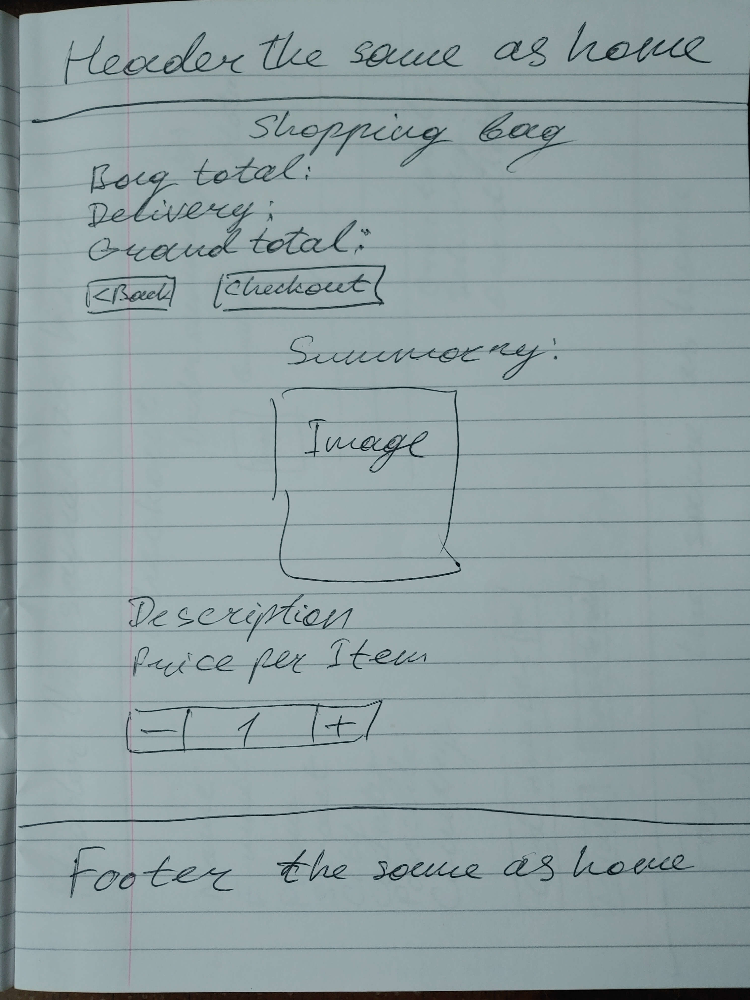
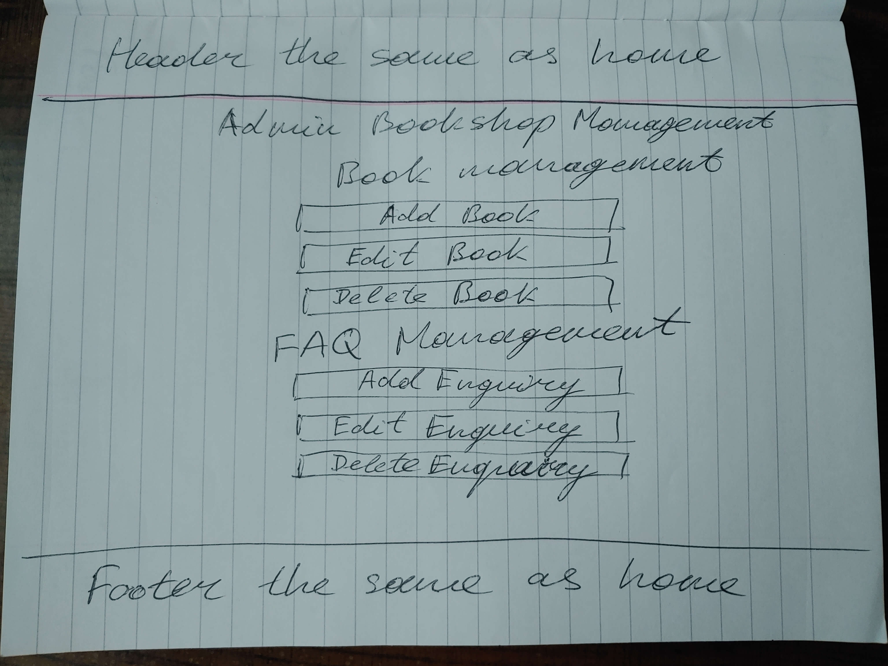

# *ABC Bookshop*

ABC Bookshop is a classic internet-shop which is used as a platform for selling books especially for educational purposes. It's made as a start-up and has a few book subjects but site owner can easiely add different book subjects by request and sells any.

One of ABC Bookshop feature is not only sell books by different subject/category but to provide age group appropriate division for all kinds of readers.

Our shop is located in Ireland and has orientation based on the Old World readers but also readers from different countries that available in list that you may see at checkout page can also buy them because we have international delivery.

You can access the ABC Bookshop here:
[ABC Bookshop](https://abcbookshop-78b85b076be8.herokuapp.com/)

If you wish to make a test purchase, you can use the following [Stripe Dummy Card](https://stripe.com/docs/testing) details:

- Test Card Number: 4242424242424242
- Exp Date: Any date in the future using the format MM/YY
- CVC: any 3 digit number
- Postcode: any 5 digits

Any payments made using a valid debit/credit card will not be processed and the card will not be charged.

For full Admin access to the Django Admin panel with relevant sign-in credentials: [ABC Bookshop Admin](https://abcbookshop-78b85b076be8.herokuapp.com/admin/)

For access to Admin Dashboard frontend view with relevant sign-in credentials: [ABC Bookshop Admin Dashboard](https://abcbookshop-78b85b076be8.herokuapp.com/bookstoremanagement/bookstoremanagement)

# Project

## Cutomer Goals

The main goal of the customer is to find interesting books to buy. What can be better than hold the real paper book in the hands? The customers are provided with a search field to quickly find books they are looking for. The customers can join the community on Facebook or sign up for a newsletter to be informed about the news within the shop. The customers can leave book review to express their opinion.

## Business Goal

ABC Bookshop provides a range of educational books for all ages. ABC Bookshop strives to create a community of education lovers to increase business possibilities. ABC Bookshop provides a very user friendly interface for bookshop admin where they can add/edit/delete books from the store, manage  enquiries. The admin can access all order details in the django admin panel and also can approve customer reviews.

## Business Model
ABC Bookshop was designed as a B2C - Business to Customer model - where the customer buys directly from the business. There are no intermediaries. This model enables direct communication with the customer and provides space for flexibility and quick reactions and adaptability to the customer's needs.

## Marketing Techniques
It is absolutely necessary to have online presence and recognition to be able to attract new customers and build a strong customer base. One of the ways to achieve this is through social platforms, e.g. the Facebook or Instagram platform, etc. Social media can be a great tool for attracting new customers and communicating with the current ones. I chose Facebook as a main communication mechanism.

* Facebook Page

   Due to Facebook doesn't allow me to create a test page for this project I created a mock up as it's real Facebook page for marketing purposes. The goal for a Facebook page is to create a community around around our ABC Bookshop and to increase commercial possibilities. I hope that through regular engagement with potential customers through posts, and other activities, we will be able to attract new customers. Facebook page will help us keep in touch with the current customers and provide a way for communication with new ones. We will be announcing new arrivals or special sales on this platform.

   <details><summary><b>Facebook Page</b></summary>

    
   
   </details><br>

* Content marketing

   There are book review possibilities to attract potential customers read them and be involved into reading and measurement.

* E-mail Marketing

   Another form of online marketing is via mailing lists. ABC Bookshop users can opt to subscribe to the company's newsletter. New arrivals, sales or other activities will be announced through this platform. [Mailchimp](https://mailchimp.com/) was used to set up the newsletter subscription functionality.

* Search Engine Optimization (SEO)

   ABC Bookshop's goal is to include itself to the top of serch results and be at least on the first page of serch results content. Descriptive Meta Tags were implemented on the site to do it. I used [Wordtracker](https://www.wordtracker.com/) to find out content specific keywords. I tried to use not only short, but also long-tail words.

   The site also includes a sitemap.xml and robots.txt to make sure that the search engines can find and crawl the pages on the site. The sitemap.xml was generated using [XML Sitemap Generator](https://www.xml-sitemaps.com/) and placed in the root folder of the project and robots.txt as well. In real life to generate dynamical sitemap.xml file and have it visible for Google Search we need to create a special functionality with .py file in root project folder that will generate content for it and have right url record in urls.py to be found.

## Project Management

I used [GitHub's Projects](https://github.com/users/dimmando/projects/3) for organizing my project and tracking user stories. It is a very helpful tool to have Kanban board and it's quite alternative to [Trello](https://trello.com/) product for the same purposes.

First of all I spent some time on project planning, on thinking about it. I created wireframes and having them and the ERD model I found it very helpful and felt myself more confident.

When I am finished with the project, I planned to go back and analyze how many userstory points I was able to achieve compared with planned for my future project planning.

I tried to make mock up of my readme and testing files at the same as I finished each user stories.

I tried to fix bugs, small or big at once not to be accumulated too much left at the end.

Primarily, I focused on completing majority of the must-haves, and in later stages of the product development I would consider should and could-haves. At the same time, I was identifying user stories which would have to change into won't haves and be left for future development. Each of the user stories got labels such as: Must have, Should have, Could have, Won't have.

The Project tool has been very benefitial for my development process, especially because I could rely on having all the relevant information in one place.

### MoSCoW Prioritization

I tried to apply MoSCoW principles in my development but more on a project basis than on a sprint basis. First of all I focused on meeting must-have dev tasks and user stories. Then I started incorporating should-haves and then could-haves. As I went along, I also indentified won't-haves which left for future development.

- Must Have: must be delivered (around 60%)
- Should Have: add significant value, but not crucial (around 20%)
- Could Have: small impact if not implemented (around 20%)
- Won't Have: not crucial for this project

### Milestones

I didn't split my project development into milestones because not so many features/tasks are in place and not a lot of time was spent doing the project. It was shortened in time course with quick pace.

## Database Schema (ERD)

Here you can find [ERD Diagram](/documentation/abc-erd.png)

I used [Lucid Charts](https://lucidchart.com/) to create my ERD.

Models used in this project:
- Checkout (Order, OrderLineItem) - For creating/updating orders
- Enquiry - for adding/updating/removing FAQ and their answers
- Products (Category, Product) - for managing books, filtering, sorting and more
- UserProfile - used to collect and update contact/delivery information of the customers
- Reviews - for adding a review to book the customer have bought and not reviewed before
- Wishlist - for adding/removing items from the user's wishlist
- Allauth - used for signing in/out/up functionality

# User Experience (UX/UI)

**Primary Goal**

The primary goal of this project is to enable a purchase educational books. The shopping experience needs to be seemless and smooth.

**First Time Visitor**

  - A user sees the main features of the app on the welcome page: find a book by different search criteria or contact us.
  - A user can register, log in and logout.
  - An anonymous user can:
    -  browse the page
    -  search for books in the search window
    -  sort books by category, name, rating and price
    -  filter the books by subject and age
    -  filter products by special offers
    -  read book reviews if present
    -  contact the store by filling in a form
    -  read FAQs
    -  subscribe for a newsletter
    -  can see the contact information including the address, phone number and email
    -  can visit the store's Social Media pages
    -  can read Terms Of Use
    -  can read Privacy Policy
    -  can add a book to their shopping bag directly form the all products view
    -  see shopping cart
    -  can add/view/delete/update number of books in their shopping cart
    -  can delete from shopping cart at all
    -  make a purchase
    -  receive an email with order confirmation
  - On top of that, a logged in user can:
    -  leave a review for books they had previously bought
    -  a user can review a book only once
    -  create a wishlist
    -  save their information in the Profile section under the profile icon and update it
    -  view their past orders
  - An admin user can:
    - manage books, FAQ's in the bookshop management section (CRUD functionality)
    - confirm deletion of products or FAQs
    - can approve a review

**Returning Visitor**

  - A user can easily register (if didn't previously), sign in and access majority of the features of the website (leave a review, create a wishlist)
  - A user with filled in profile details can make purchase faster
  - A user can easily find books on sale/new arrivals

**Frequent Visitor**

  - A user can easily find a suitable book and make a quick purchase (thanks to the saved personal information) and use any other user features.


## Design Choices

Usually we start any internet business we try to create an attractive web-site where the user can easily find something they like. Firstly, I designed wireframes, then I was thinking which color scheme is best.

## Design Wireframes

The wireframes include a view for desktop, tablet/mobile to take responsivnes into account. Many of the simple pages look the same on all devices (sign in, sign up, logout, forms,...). Only header and footer change (the same on all pages) from desktop to mobile version.

**Desktop and Tablet/Mobile Wireframes**

<details><summary><b>Home Page</b></summary>


</details><br>

<details><summary><b>Product Detail Page</b></summary>


</details><br>

<details><summary><b>Shopping Bag</b></summary>




</details><br>

<details><summary><b>Checkout</b></summary>


</details><br>

<details><summary><b>Admin bookshop management</b></summary>




</details><br>

<details><summary><b>Profile</b></summary>


</details><br>

**Color Scheme**

Color scheme was created ispiring strict business style. No fun color. Just business style.


**Typography and Icons**

I mainly used fontawesome icons, but some static icons in place as well.

! - exclamation mark means New Arrival;
SALE icon - means the book with reduced price.

I used 'Barlow' font from Google fonts in the body and the 'Abril' font in the Logo and it seems it's work well with the ABC bookshop theme.

# Features

## CRUD Functionality

Customers have full CRUD functionality for the shopping bag (viewing/adding/updating the amount/removing products from bag). They may also edit their delivery details if they are registered, logged-in users. Logged in customers may also view/add and remove products from their Wishlist and add reviews to books they had previously bought. ABC Bookshop Admin has access to the Admin Dashboard which allows them full CRUD for Books/Enquiries Management.

## Features Details

**Navbar**

At the top of the page there is a navbar. At the top there is a **delivery banner** with information about the threshhold price which qualifies the customers for free delivery. Currently the threshhold price is set to €100.

Second row contains the company's Logo, which is clickable and takes the user to the Home page.

In the middle of the second row, there is a search bar which allows for searching books.

When the user is not signed in, only Profile (Register/Login options only) and Shopping bag icons are available.

**Guest User**

<details><summary><b>Top Navbar Guest</b></summary>


</details><br>

**Logged in User**

A wishlist icon becomes available for the signed in user. It's regular when the Wishlist is empty and solid when at least one item in it exists.

If the user signs in, they can access My Profile, where default information is saved and they can access their past orders.

<details><summary><b>My Profile</b></summary>


</details><br>

Wishlist and Shopping bag icons change color if there is at least one product present.

<details><summary><b>Wishlist/Bag Icons orange</b></summary>


</details><br>

**Collapsible Navbar**

<details><summary><b>Collapsed Navbar</b></summary>


</details><br>

<details><summary><b>Hamburger Open</b></summary>


</details><br>

**Navbar Bottom Row**
In the last line of the navbar the user can click the following links:
- Home - takes the user to the home page
- Subject - category filtering available
- Special offers - new arrivals, on sale
- FAQ - frequently asked questions
- Contact us - takes the user to the contact form

<details><summary><b>Navbar Bottom Row</b></summary>


</details><br>

<details><summary><b>Navbar Sorting</b></summary>


</details><br>

<details><summary><b>Navbar Skill Level</b></summary>


</details><br>

<details><summary><b>Navbar Specials</b></summary>


</details><br>


**Account registration/login/logout**

All user functionalities are a result of using django-allauth. Using this package has enabled me to set this functionality up quickly and easily. The user is informed if their password is too common or if it is too similar to their user name or email address.

**Sign Up Page**

Sign up Page has a simple design. The user has to enter their email address and password twice. This is due to defensive programming principle where we try to avoid unnecessary errors caused by small typos.

The user has to confirm their email address to finish up the registration process.

**Sign In Page** and **Logout Page** have intuitive functionality not needed to describe here.

The user can choose to remember their profile and they can avail of the inbuilt forgot password functionality as well.

**Home page**

The user can get to all books page at once the site is loaded. All books are displayed on main page in the form of product cards which contain the book's image, title, price, category, age range, rating, Add to Bag and Add to Wishlist/Remove from Wishlist buttons. The latter is available only for a signed in user if the item is already in the wishlist.

The books are displayed in rows of 4, 3, 2 or one depending on the screen size. There is implemented pagination functionality.

The user can directly add one piece of the chosen product to the shopping bag.

The user can add a product to the wishlist if they are signed in.

The heading always reflects what segment of books is being displayed (e.g. All Books, New Arrivals,...).

Sorting products by price, rating, name and category is available from the navbar. The books can be ordered in descending or ascedning order. The sorting choice is reflected in the sorting window, which is available in the right top corner.

Sorting by sales price works correctly (sales price is taken into account if a product is on sale).

If a product is in one or more of the specials categories, the correct icons are displayed in the top right corner of the product card. If a product is on sale, the sale price is on the right in red and the original price is crossed out.

Age filtering is available under the main heading on all products page. The age filtering takes into account a previous segment selection.

If an admin is signed in, the edit/delete buttons are visible on the individual product cards as well. For details see the admin section.

Back to top button is present in the right bottom corner of the page.

**Book Detail View**

Each book detail page contains an image of the book, the title, the author, category, age range, price, rating and book description. The description is collapsed and can be unpacked by clicking read more button or collapsed by clicking read less button.

The quantity of the product can be adjusted before add the product to the shopping bag. Only whole numbers can be accepted and the user is informed if they try to add a floating number.

Keep shopping button takes the user back to all books view. A correct specials icon is included under the book picture. Also a Add to wishlist button is present and it changes to Remove from wishlist button if the user had previously added this product to their wishlist.

If an admin is signed in, the edit/delete buttons are visible as well. For details see the admin section.

If a book has been reviewed before, there is also an expandable button with a review icon and number of reviews present. For more details please see the Reviews section.

If a book image is clicked, the image opens in a new tab for a more detailed view.

**Contact Form**

A user can send an enquiry to the store admin.
They see a thank you page when the enquiry is submitted and also a success toast.
An email is received by admin which they can reply to.

**My Profile**

If a user has created an account with ABC Bookshop, they can save and update their default delivery information under their "My Profile" link under the Profile icon. Also the order history is accessible there and the orders are ordered from the newest to the oldest.
The order history number is clickable and opens up a past order confirmation (the user is informed about this being a past confirnation).
Back to Profile button takes the user back to their My Profile page.

**Shopping Bag**

As this is an ecommerce project, one of the crucial features is the possibility to add products to the shopping bag and subsequently make a purchase.

Both a guest and a registered user can make a purchase. If the user has an account, they can access their order history under My Profile. Both guest and registered users will receive an email upon purchase.

A user can add one book directly from the all books view by clicking on Add to Bag button, or they can adjust the quantity in the book detail view and add a product from there. The entered quantity must be a whole number and must not exceed 10 pieces due to the restricted capacity of the book store.

When a user adds a product to their bag, they see a success toast with the bag information and are informed about the delivery cost if the total amount is below €30. They can choose to click on Go to Your Bag and go to the shopping bag page where they can adjust the amount/remove the book entirely or click Keep Shopping button to continue shopping. User is informed about all of their actions and the updated quantities are reflected in the success toast.

As soon as there is at least one item in shopping bag, the icon changes color to orange.

**Secure Checkout**

The checkout process for ABC Bookshop is done through the [Stripe](https://stripe.com/docs) API.

Both a guest and signed in user can go to checkout by clicking Go to Checkout button. If the user has an account and are signed in, their information is prefilled, if previously saved. They have to enter their Full Name and add credit card details. For testing purchases this card number was used: 4242 4242 4242 4242. The user must enter a future expiry date, the secure number and a 5 digit postcode.

The user can choose to adjust bag their bag which takes them back to their shopping bag, or to click Complete Order button.

The Stripe Payment form accepts the user's information and informs them if they try to use an invalid card number. Form validation is also present and the user is informed if they have not entered all of the details.
As soon as the order is processed, the customer gets an email confirmation and is shown the order success message with order details.
As a developer I can confirm in Stripe webhooks that the orders has been successfully processed.

**Review Books**

When a user receives their order confirmation, there is a list of products with details present. The individual books can be clicked on and the user is taken to the detail page of the particular book. If the user is signed in and they had not reviewed this particular book previously, there is a review form present where the user can express their opinion. These review links are available in the order history under My Profile as well.
Upon submission, the user is informed that the admin has to approve the review first.
As soon as the review is approved, the number of reviews on the detail page of the chosen book is automatically updated and the user can click on the reviews button and the review is visible.
Each user can review a particular book only once. So in case the customer had bought the same book before and had already reviewed it, the review form will not be visible.

**Wishlist**

As mentioned before, a wishlist functionality is available for registered users only.
If a guest user attempts to add an item to their wishlist, they are asked to login (register) and then they can avail of this functionality.
If a user attempts to add a book which is already in their wishlist, they are see a warning message.
If a particular book was added to the wishlist and the user is signed in, the Add to Wishlist button changes to Remove from Wishlist button.
On the Wishlist page the user can choose to add the book to their shopping bag.

**bookshop management/Admin (CRUD functionality)**

When an admin user is logged in, the bookshop Management link is available under their Profile. This feature was added so that the store admin user can perform all necessary tasks around store management without having to access the Django admin panel. Only a signed in admin can access the bookshop management link.
An admin can add/edit/remove books from the store, add/edit/remove enquiries.
When an admin user is signed in, edit/delete buttons are present on the book and enquiry cards.

**Book Management**

**Add Book**

When the admin clicks an Add Book button, they are taken to an add a book form. Input is validated (e.g. all numbers must be positive integers, more details in the testing file).
When the user clicks on the edit button, they are taken to all books view, where the edit buttons are visible and clickable.
On the edit book form, the book details are already prefilled and can be amended.
When the admin wants to delete a book, they are shown a deletion modal to provide a chance to cancel the deletion. If they are sure and confirm deletion, the product is deleted.

**Enquiries/Enquiries Management**

There is a link to enquiries/FAQs in the footer to provide quick answers to common questions of the store's customers. The questions are clickable and answers are displayed.


**Add Enquiry**

When the admin clicks an Add Enquiry button, they are taken to an add an enquiry form. Input is validated.
The admin can choose to save the enquiry as a draft in which case only admin can see it in the all enquiries view.
When the user clicks on the edit button, they are taken to all enquiries view, where the edit buttons are visible and clickable.
On the edit enquiry form, the enquiry details are already prefilled and can be amended.
When the admin wants to delete an enquiry, they are shown a deletion modal to provide a chance to cancel the deletion. If they are sure and confirm deletion, the enquiry is deleted.


**Footer**

At the bottom of the page there is a footer. For easy of use, all main navigation links are present.

<details><summary><b>Footer</b></summary>


</details><br>

- Links to social media including the store's Facebook page

- Frequently Asked Questions (more details above)

- Privacy Policy

- Terms of Use

Both Privacy Policy and Terms of Use were generated by using termly.io.

- Shipping Info (can be found in FAQs)

A customer can subscribe to a **Newsletter** by clicking the Subscribe Now! button, also present in the footer. 

Last but not least, the user can see the contact information, including the address, email and a mobile number.

The footer is responsive and was optimized for small devices by collapsing some of the information under the HELP link.

**Newsletter**

In order for customers to stay informed about the news in our bookshop we provide a newsletter functionality. This feature was developed through [Mail Chimp](https://mailchimp.com/) 
When the user clicks on Subscribe Now! button, they are taken to a separate page, where they can easily fill in their email and subscribe.

**403, 404 and 500 Error Pages**

If a user navigates to a page that does not exist, a customized 404 error page will appear.

If a user attempts to do something they are not authorized to do, they will get a custom 403 Error page.

If a user navigates to a page and there is a server/database related issue/error, they will be shown a customized 500 error page.


## Future Features

Here are some of the features I have left to the future development related to user stories labelled Won't have:
- Download .pdf file with order summary
- Contact Us requests saved in the Admin panel
- Calculate book Rating based on user's vote

# Technologies Used
## Languages

- [Python](https://www.python.org/) - Used for adding functionality into project.
- [HTML](https://en.wikipedia.org/wiki/HTML) - Provides the content templates for the website.
- [CSS](https://en.wikipedia.org/wiki/CSS) - Provides the styling for the website.
- [JavaScript](https://en.wikipedia.org/wiki/JavaScript) - Provides interactive elements of the website

## Frameworks and Software

- [Bootstrap](https://getbootstrap.com/) - A CSS framework that helps building solid, responsive, mobile-first sites.
- [Django](https://www.djangoproject.com/) - framework used to create main functionality.
- [Github](https://github.com/) - Used for hosting the repository.
- [Projects in GitHub](https://github.com/lucia2007?tab=projects) - Used for project managament, Kanban board.
- [Heroku](https://heroku.com/) - Used for deploying the application.
- [Gitpod](https://www.gitpod.io/#get-started) - Used for developing the application.
- [Favicon Converter](https://favicon.io/favicon-converter/) - used to create a favicon in correct format.
- [Google Chrome DevTools](https://developer.chrome.com/docs/devtools/) - Used for debugging.
- [Lucid Charts](https://lucidchart.com/) - for creating my ERD scheme.
- [Cloudinary](https://cloudinary.com/) - used for storing images.
- [Stripe](https://stripe.com/en-cz) - used as a payment system.


# Python Packages

Following packages and libraries were installed and are located in requirements.txt:

- asgiref==3.8.1
- cloudinary==1.36.0
- crispy-bootstrap5==0.7
- dj-database-url==0.5.0
- dj3-cloudinary-storage==0.0.6
- Django==4.2.16
- django-allauth==0.57.2
- django-countries==7.2.1
- django-crispy-forms==1.14.0
- gunicorn==23.0.0
- oauthlib==3.2.2
- Pillow==10.0.0
- psycopg2==2.9.10
- PyJWT==2.9.0
- python-dateutil==2.8.2
- python-slugify==8.0.1
- python3-openid==3.2.0
- requests-oauthlib==2.0.0
- sqlparse==0.5.1
- stripe==6.5.0
- text-unidecode==1.3
- urllib3==1.26.20
- whitenoise==5.3.0

---
# Testing

To test the aspects of the application, I used manual testing and external validators. Both manual and external testing are a part of a separate [testing file](/TESTING.md).

---

# Project Deployment

Follow the steps below to deploy your project:
## Create a new GitHub Repository from CI template

- Navigate to [GitHub](https://github.com) and create a GitHub repository from the [Code Institute template](https://github.com/Code-Institute-Org/ci-full-template) by following the link and then click 'Use this template'.

- Fill in the needed details and then click 'Create Repository From Template'. The name you choose must be unique.

## Install Django and the supporting libraries

- To install Django and the supporting libraries, type the commands below.

* ```pip3 install 'django' gunicorn```
* ```pip3 install dj_database_url psycopg2```

- When Django and the libraries are installed we need to create a requirements file.

* ```pip3 freeze --local > requirements.txt``` - This will create and add required libraries to requirements.txt

- Create the project.

* ```django-admin startproject YOUR_PROJECT_NAME .``` - This will create your project

- When the project is created, we can now create the application.

* ```django-admin startapp APP_NAME``` - This will create your application

- To create a superuser type in the following code:
`python3 manage.py createsuperuser`

You will be asked to enter credentials after which the superuser is created.  

- We now need to add the application to settings.py

- Now do your first migration and run the server to test that everything works as expected. This is done by writing the commands below.

* ```python3 manage.py migrate``` - This will migrate the changes.
* ```python3 manage.py runserver``` - This runs the server. To test it, click the 'open browser' button that will be visible after the command is run.

- Create `env.py` file at the root level and include the following environment variables. Don't forget to add the `env.py` file in the `.gitignore` in order to keep your secret information from becoming unsafe:

`import os`

`os.environ["DATABASE_URL"] = "insert your own database URL here"`

`os.environ["SECRET_KEY"] = "this can be any random secret key"`

- In the `settings.py` add the following code under `from pathlib import Path`:

`import os`

`import dj_database_url`

`if os.path.isfile("env.py"):`

`import env`

* Replace the original unsafe SECRET_KEY with the following code:

`SECRET_KEY = os.environ.get('SECRET_KEY')`

* Set `DEBUG = "DEVELOPMENT" in os.environ`. This allows us to have DEBUG set to True when developing locally, but set to False when deployed to Heroku.

* Replace the original `DATABASES` code with the following lines (this allows us to use the postgress database instead of the sqlite3 databases):

`
DATABASES = {
    'default': dj_database_url.parse(os.environ.get("DATABASE_URL"))
  }
`

* Link the file to the Heroku templates directory:
- Under ``BASE_DIR`` enter ``TEMPLATES_DIR = os.path.join(BASE_DIR, ‘templates’)``
- Update ``TEMPLATES = 'DIRS': [TEMPLATES_DIR]`` with:

```
os.path.join(BASE_DIR, 'templates'),
os.path.join(BASE_DIR, 'templates', 'allauth')
```

* Create the following folders at the top level directory:
  * static
  * templates
  
* Create a file called **Procfile** and add the following line in it:
`web: gunicorn PROJECT_NAME.wsgi`

* Make necessary migrations.

* Save all the files and do the first commit and push to GitHub:
  * `git add .`
  * `git commit -m "Deployment Commit"`
  * `git push`

## PostgreSQL Database

[PostgreSQL](https://postgresql.com/) is used for the PostgreSQL database in this project.

## Heroku Deployment

The project was deployed to [Heroku](https://www.heroku.com). To deploy, please follow the process below:

Create the application on Heroku, attach a database, prepare the `env.py` and `settings.py` file and setup the **Cloudinary** for media files. Static files are collected by Heroku using Whitenoise app that included in requirements.txt file.

* Go to [Heroku](https://www.heroku.com/) and sign in (or create an account if needed).

* Once signed in, click the button "New" in the top right corner, below the header and choose "Create new app". The name you choose must be unique. Choose a region which is closest to you.


- This brings you to the "Deploy" tab. From here, click the "Settings" tab and scroll down to the "Config Vars" section and click on "Reveal Config Vars". Click the "Add" button on the right and add the following key/value pairs:

   - **DATABASE_URL**:**postgres://...**
   - **SECRET_KEY** and value  
   - **CLOUDINARY_URL** and value
   - **EMAIL_HOST_PASS** and value
   - **EMAIL_HOST_USER** and value
   - **STRIPE_PUBLIC_KEY** and value
   - **STRIPE_SECRET_KEY** and value
   - **STRIPE_WH_SECRET** and value

Heroku needs two additional files in order to deploy properly (see above):
- `requirements.txt`
- `Procfile` 

- Scroll back to the top of the page and choose the "Deploy" tab. Then choose "GitHub" as Deployment method.

Go to "Connect to GiHub" section, search for the repository name and then click "Connect".

- In the "Automatic Deploys" section, choose your preferred method for deployment

Alternatively, you can follow these steps:
- In the Terminal/CLI connect to Heroku by typing in: `heroku login -i`
- Set the remote for Heroku: `heroku git: remote -a app_name` (replace app_name with your app name)
- After doing Git `add`, `commit`, `push` to GitHub, you can type in: `git push heroku main`

The project should now be deployed to Heroku.

The link to the the live site can be found here - [https://abcbookshop-78b85b076be8.herokuapp.com/](https://abcbookshop-78b85b076be8.herokuapp.com/).
The link to the GitHub repository can be found here - [https://github.com/dimmando/abc-bookshop](https://github.com/dimmando/abc-bookshop)

## Stripe Config

Stripe's API is used to handle ABC Bookshop's payment system. To setup follow the below steps:

- Create a Stripe account and log in.
- In the Stripe Dashboard -> **Get your test API keys.**
- Add your `STRIPE_PUBLIC_KEY` and `STRIPE_SECRET_KEY` to your env.py, connect to your settings.py using your environment variables and then enter them into your project's Heroku Config Vars.
- Include Stripe's Webhooks to create an intennt if a customer exits the page during payment authorisation. In Stripe's Dashboard -> **Developers** -> **Webhooks** -> **Add Endpoint**: 'herokuapp url/checkout/wh'
- Choose **Retrieve all events** -> **Add Endpoint**.
- Add new key **STRIPE_WH_SECRET** to env.py, settings.py and Heroku Config Vars as before.

## To create a local clone of a project

Take the following steps to create a clone of a project:

1. Click on the **Code** button in the left top corner.
2. Next to the green **GitPod** button, click on **Code** drop-down menu.
3. In the **HTTPS** section, click on the clipboard icon to copy the displayed URL.
4. In your IDE of choice, open **Git Bash**.
5. Change the current working directory to the location where you want the cloned directory to be made.
6. Type `git clone``, and then paste the URL copied from GitHub.
7. Press **enter** and the local clone will be created.
8. Install requirements to get the project to work by typing in this command:
   `pip3 install -r requirements.txt`
   This command downloads and installs all the required dependencies as found in `requirements.txt file`.
9. Set up environment file (`env.py`) so that the project knows what variables are needed to make it work. For retrieving the Cloudinary/Stripe API key and PostgreSQL url, please follow the steps in the relevant sections. 
10. These variables are hidden due to sensitivity of the information. You must not push the `env.py` file to GitHub. You will achieve this by adding the `env.py` to the `.gitignore`-file. The variables that are declared in the `env.py` also need to be added to the **Heroku config vars** apart from the ["DEVELOPMENT"] variable, for detailes see above. 

11.  Make all the relevant migrations before running the server by:
    - `python3 manage.py migrate` - this makes the necessary migrations
    - `python3 manage.py runserver` - enables the project to live locally 
    - `python3 manage.py createsuperuser` - this creates a superuser after you provide credentials

# Credits
## Content
- [Code Institute](https://codeinstitute.net) for general guidance and mainly for sample of Boutique Ado project
- [Privacy Policy and Terms of Use by Termly](https://termly.io/products/terms-and-conditions-generator/)
 
## Tools
- [Adobe Photoshop](https://www.adobe.com) for image editing
- [tinypng](https://tinypng.com/) for reducing image size
- [Lucid Charts](https://lucidchart.com/)

## Media
- Images were taken from [Unsplash](https://unsplash.com/), [Amazon](https://www.amazon.co.uk/)
- Books were taken also from [https://uk.bookshop.org/](https://uk.bookshop.org/)

## Acknowledgements
- Extra help and guidance was received from my mentor [Juliia Konovalova](https://github.com/IuliiaKonovalova) and from tutors from the Code Institute.