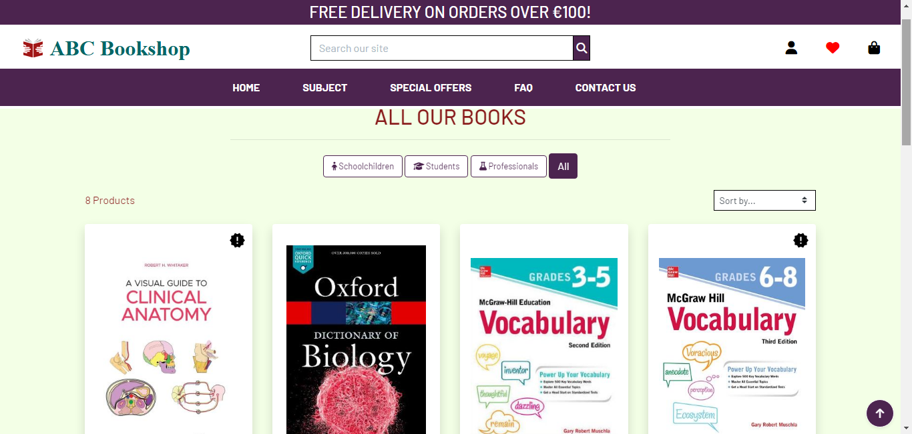
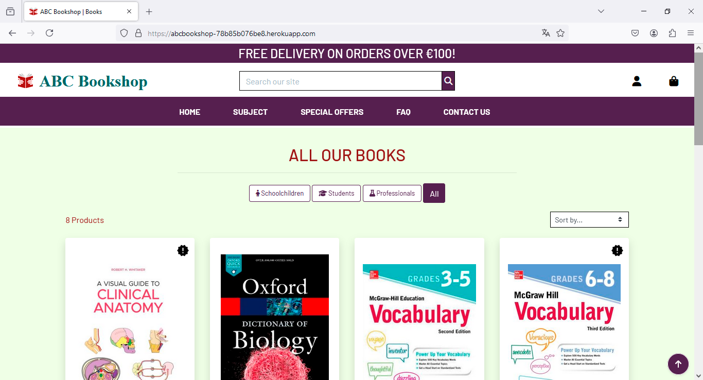
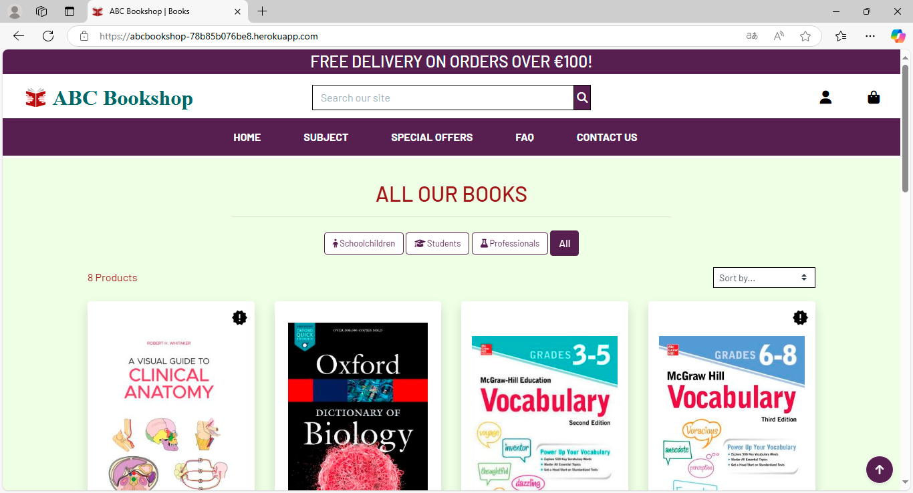
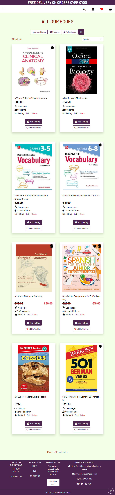
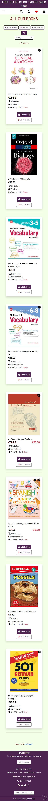
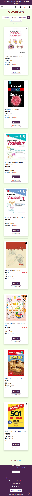
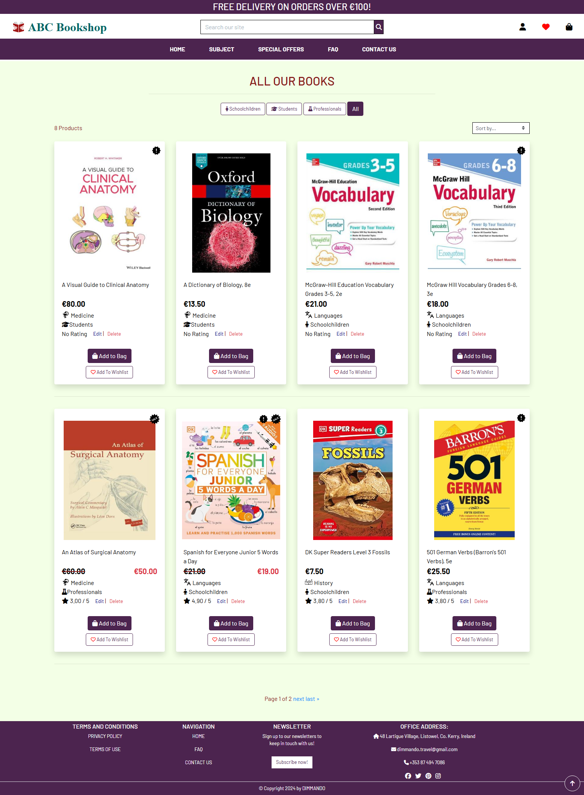
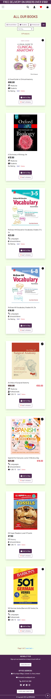
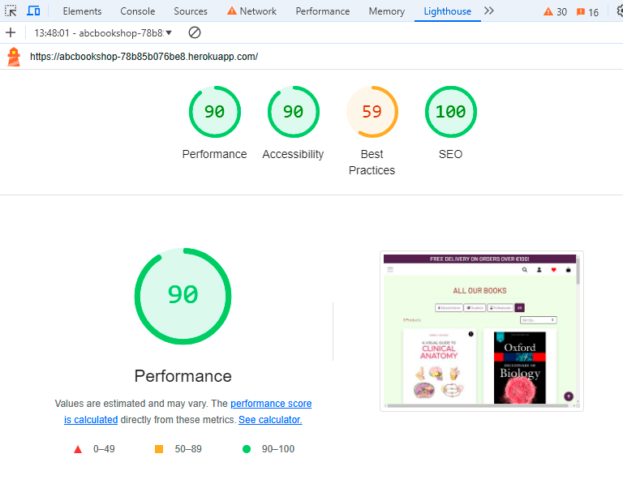

# TESTING

## Compatibility

In order to confirm the correct functionality, responsiveness, and appearance:

+ The website was tested on the following browsers: Chrome, Firefox, Edge.

    - Chrome:

    

    - FireFox:

    

    - Edge:

    

## Responsiveness

+ The website was checked by Responsive Viewer - Chrome browser extension
    
    

<b>iPad-Air-5-Resolution: 820x3505</b>

    
    
    
 

     

<b>iPhone-14-Pro Resolution: 393x6516</b>

    
    
    
    
 

    

<b>iPhone-14-Pro-Max Resolution: 430x6427</b>

    
    
    
 

    

<b>Macbook-Air Resolution: 1559x2120</b>

    
    
    
 

    

<b>Pixel-7-Pro Resolution: 480x6403</b>

    

    
 

Due to all the pages use  their header and footer are identical. The content everywhere (except small pages like Log In, etc.) loads dynamically and styled with CSS well so rest of the pages have the same responsiveness as a main page.

### Manual testing

  - I used manual testing throughout the whole development phase of the project. Mainly:
  - I deployed early to avoid any last minute issues. With the live site, I could check responsivness from early on different devices.
  - I used validators to check my HTML, CSS and backend code.
  - For each of the user stories I wrote down clear acceptance criteria and tasks which had to be done to meet those criteria.

### Automated Testing

I had not managed to do automated testing for this application, but I plan to make it a regular part of my development process in my future projects.

Also the functionality of the ABC Bookshop website was checked as well by different users registered on it.

---
## Validator testing

+ ###  Python

  Source code of all custom .py-files were tested by the PEP8 Python Validator.
  No errors or warnings were found when passing tests.

  Here are PDF-documents with validator screenshots for all applications:

  * [abcbookshop](documentation/pdf/abcbookshop.pdf)

  * [bag](documentation/pdf/bag.pdf)

  * [bookstoremanagement](documentation/pdf/bookstoremanagement.pdf)

  * [checkout](documentation/pdf/bookstoremanagement.pdf)

  * [contact](documentation/pdf/contact.pdf)

  * [enquiry](documentation/pdf/enquiry.pdf)

  * [newsletter](documentation/pdf/newsletter.pdf)

  * [products](documentation/pdf/products.pdf)

  * [profiles](documentation/pdf/profiles.pdf)

  * [review](documentation/pdf/review.pdf)

  * [wishlist](documentation/pdf/wishlist.pdf)

+ ### HTML
  Source code of all HTML-pages were tested by the official W3C validator.
  Only on Subscribe page in Mailchimp code some info and warnings were found when passing tests. No errors were found.
  Here is the PDF document that contains screenshots of all tests:

  [HTML Validator](documentation/pdf/html-validation.pdf)
        
+ ### CSS
  No errors or warnings were found when passing through the official W3C (Jigsaw) validator.
  Here is the PDF document that contains screenshots of all tests:

  [CSS validator](documentation/pdf/css-validation.pdf)

+ ### JavaScript
  Here is the PDF document that contains screenshots of all tests:

  [JavaScript validator](documentation/pdf/js-validation.pdf)

  Small parts of JavaScript were also included into html-files. No problem with them found.

  ## LightHouse report

  Using lighthouse in devtools I confirmed that the website is performing well, accessible and colors and fonts chosen are readable.
  
  
---

## Testing user stories
 
User Story |  Test | Pass
--- | --- | :---:
As a site user I can access the application's home page so that I can understand the app's purpose and structure. | When the website loads, the user can see the home page with paginated all products list. Home page navigation, product cards and footer are in the correct place. | &check;​
As a site user, I want to search the books I interested in so that I can enter keywords into the search bar and find a specific item. | Search bar is accessible in the navigation area. Search function brings user to the searched items. | &check;​
As a site owner I want to create a book to sell so that I can add all product related info to the bookshop's database. | Product add menu item. Product info form and adding it to database. Product visible on website product view page. Update database with product's info. | &check;
As a site user, I can easily scroll through all products so that I can see all the products the ABC Bookshop offers. | All books are visible on the homepage in paginated manner. | &check;
As a site user I can click on an individual book so that I can see the title, author, book description, price, category, EAN etc. | User can click on an item to view its details and image. | &check;
As a site user I can sort the products according to the price, category and rating so that I can see the products sorting according to the chosen criteria. | The products can be sorted according to price, rating and category name by clicking on the appropriate menu at the navbar. | &check;
As a site user I can filter the books according to their category, different special features so that I can quickly find the products I'm interested in. | When the user clicks on different books category, only books from that category are displayed. When the user clicks on different special offers, only relevant products are shown. | &check;
As a site user I can register and have my own account with personalized data so that I can easily review my past activities on the site, then login and logout at any time. | "Register" link under appropriate icon in nav menu for a user that is not signed in. By clicking on the link it takes the user to the correspondent page. "Login" link under appropriate icon in nav menu for a user that is not signed in. By clicking on the link it takes the user to the correspondent page. "Logout" option also available under appropriate icon in nav menu for the signed in user. By clicking on the link it takes the user to the correspondent page. | &check;
As a site user I can choose the quantity of the interested product and add it to the shopping bag so that I can buy it. | Select +- buttons and window to indicate the product quanitty is visible. Add to bag button is visible. A shopping bag view with products details, quantity, subtotal and delivery fee is displayed when clicking on the shopping bag button. Continue shopping button takes the user to the all products view. | &check;
As a site user I can securely checkout the chosen items in my shopping bag so that I can finish my purchase. | The user can change the number of books into the shopping bag. The user can remove the item completely. The user is informed through toast messages about their actions (adding, removing, updating). The user can process the order and it is displayed in Django Admin panel. | &check;
As a developer I can display user-friendly customized error pages so that they correspond to the overall site design. | When the user attempts to make an unauthorized action, custom 403 error page will display. When the user makes a mistake in the address, they are taken to 404 error page. If user makes a bad request, they are shown a 500 error page. | &check;
As a site user I can add desired books into my wishlist so that I can be remember them for a later purchasing. | The user can click on "Add to Wishlist" button to add the chosen item to wishlist. The user can delete an item from the wishlist. The user can choose to add the chosen product into shopping bag from the wishlist page. When the customer put their first item in the wishlist, the appropriate red color icon changes its state from regular to solid. When the customer deletes all items from the wishlist, the icon changes back from solid to regular. | &check;
As a site user I can subscribe for a newsletter from ABC Bookshop so that I can receive any marketing and other messages from the site owners. | Not annoying button in the site footer for Newsletter subscription that leads the user to a separate page for signing up for the newsletter with confirmation about being signed up. | &check;
As a site user I can easily see which products are in the specials category so I can avail of specials deals like sale, new arrival or a featured product. | Relevant icons are displayed on product's card if it is in on sale, new arrival or a featured product. The icons are displayed on all pages: all products list, specials pages, on product detail view and wishlist pages. | &check;
As a site user I can contact the ABC Bookshop not only by phone or Email but filling in a form directly on the webpage so that I don't have to send emails. | Contacts Us button in the navbar leads users to the "Get in touch with us" page. The user can fill in the contact form with the First Name, Last Name, Email and message they would like to send to the shop. The user is informed about successful form submission. | &check;
As a site user I can easily find answers to frequently asked questions (FAQ) so that I don't have to call or write to the ABC Bookshop owners requests. | A user can click on FAQ link on the footer that leads to a separate page, where they can click on different questions and read the answers. The admin can add/edit or delete questions with answers via ABC Bookstore management link in the navbar. | &check;
As a site user I can read Privacy Policy so that I can understand my rights along with using ABC Bookshop. | When the user clicks on Privacy Policy in the footer, the document is displayed. | &check;
As a site user I can learn what is the Bookshop's Terms and Conditions so that I can understand my obligations when using the shop. | When the user clicks on Terms of Use in the footer, the document is displayed on separate page. | &check;
As a site user I can buy items with reduced price so that I can choose them according special note. | When an item is on sale, the reduced price will show on both the product and product detail pages, the original price is crossed out.
When the user puts the reduced item into the bag, the reduced price is taken into account and charged. | &check;
As a site user when I bought a book I can add a review on it finding it in my order history so that I can express my opinion. | Only a user who had bought the book before and signed in to ABC Bookshop then can review a book. The review must be approved by the admin. The review is accessible from the product detail view page. | &check;
As a site user I can visit the ABC Bookshop's facebook page so that I can have access to the news and photos from shop owners and become a follower of the bookshop. | When the user clicks on the Facebook icon in the footer it leads to the ABC Bookshop facebook page. | &check;
As a site user I can receive an E-mail after purchase with details what I bought so that I can remember my purchase and find it in my mailbox. | E-mail is received by user with correct order information. | &check;

## Bugs
+ ### Solved bugs
    Bugs were found during working with form because of the Crispy Forms fields are hard to manage. Needed to correct display Current image when editing (if present) or display placeholder instead or even print No image yet message when you only add new property (there were the bugs).
    
        *Solutions:* I solved it by using ChatGPT.com help and changing widget for images behaviour and establish some conditions logic.

+ ### Unsolved bugs
    None.

+ ### Mistakes
    No mistakes were found.   
---